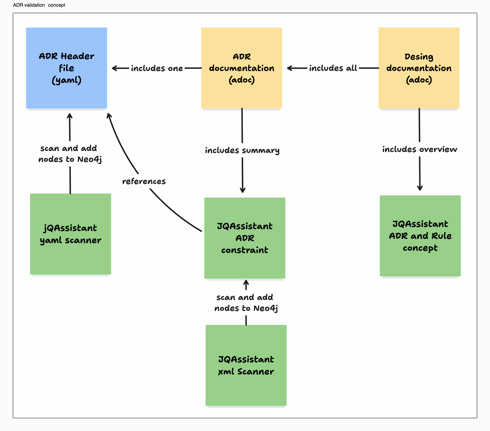
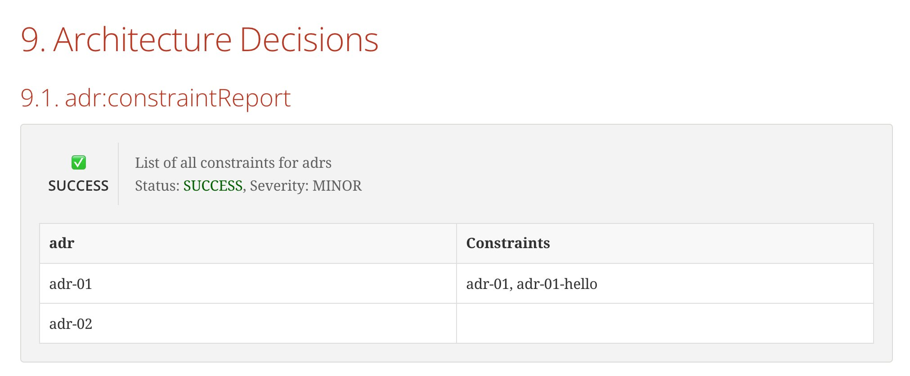

# Architecture verification and documentation with jQAssistant and arc42

There are plenty of tools available for gaining insights into IT systems, like static code analysis, vulnerability scans, and runtime metrics and monitoring solutions. Each of these tools offers unique insights into various system aspects and can serve as quality gates or fitness functions (see [*Building Evolutionary Architectures* by Neal Ford et al.]([https://evolutionaryarchitecture.com/)).

However, tools specifically designed to monitor architectural aspects and decisions, and verify implementation against design, aren't as widespread. That's where [jQAssistant]([https://github.com/jQAssistant) comes in — it aims to fill this gap.

Thanks to its versatile concepts, jQAssistant can be used for a variety of tasks. In this article, I'll share some use cases and ways to leverage jQAssistant, hoping to inspire your own projects.

I won't dive into the core concepts and setup of jQAssistant here. Plenty of other resources cover those:

* For general info, the [jQAssistant Manual](https://jqassistant.github.io/jqassistant/current/) is your best starting point.
* For project setup and usage, [this blog series (German only)](https://uxitra.de/2024/04/04/codestrukturanalyse-mit-jqassistant-teil-1/) is worth a look.

We'll use a small sample project implementing a [Ports and Adapters Architecture](https://en.wikipedia.org/wiki/Hexagonal%5Farchitecture%5F\(software\)). You can find it on [GitHub](https://github.com/stmu-zuhlke/jqa-sample).

Let's dive in!

## How to write rules

Before we start, let's have a look on some best practices of how to write jQAssistant rules. Again, I won't go into all the details, but to go further, we should understand the core concepts and workflows.

jQAssistant is based on rules. Rules can be either **concepts** or **constraints**.
Concepts enhance the graph initially created by the file scanners and plugins with project or domain related concepts.
Constraints on the other hand are validation rules. You can think of concepts as the domain language of your architecture and constraints as unit tests or assertions to validate the system structure.

Custom rules are defined in XML files within the `jqassistant` folder. Within these files, we write cypher queries executed by jQAssistant.
For more information on writing rules, check out the [rules manual](https://jqassistant.github.io/jqassistant/current/#_rules) and [the rules in the sample project](https://github.com/stmu-zuhlke/jqa-sample/tree/master/jqassistant).

### Rule severity

JQassistant rules come with a severity level, giving you the power to finely tune which rules should actually break your build and which ones should just serve as warnings or informational notes.
This flexibility makes rule validation and reporting way more adaptable to your specific needs.

given the following example:

```xml
    <constraint id="my-constraint" severity="blocker">
        <description>example constraint</description>
        <cypher><![CDATA[
            MATCH (file:Type)
            RETURN file
    ]]></cypher>
    </constraint>
```

<div data-node-type="callout">
    <div data-node-type="callout-emoji">ℹ</div>
    <div data-node-type="callout-text">
    To reduce clutter, all future rules in this article will only show the cypher query.
    </div>
</div>

the `my-constraint` constraint is set to a `blocker` severity level. This is the highest severity, meaning the rule will result in a fail if the result count is not zero.

If we set this to e.g. `minor`, only a warning will be printed out.

Here's a quick rundown of the supported severity levels:

* info
* minor (default for concepts)
* major (default for constraints)
* critical
* blocker

You can adjust the threshold levels for warnings and failures with these configuration options:

* 'jqassistant.analyze.report.warn-on-severity' (default: minor)
* 'jqassistant.analyze.report.fail-on-severity' (default: major)

Warnings and failures will show up on the console and in the generated reports.

Additionally, the `jqassistant.analyze.report.continue-on-failure` setting (default: false) determines whether jQAssistant continues or stops if failures are found during analysis.

### Develop and debugging using the Neo4j explorer

Writing and debugging rules directly in XML can be quite cumbersome. Luckily, jQAssistant offers a full-fledged Neo4J instance complete with the Neo4J explorer. This tool is perfect for developing, testing, and debugging your Cypher queries. Here's a streamlined development process:

1. Run the initial scan.
2. Start the local Neo4J instance.
3. Inspect the current graph and develop concepts and rules using the Neo4J explorer.
4. Compile everything you need into the XML files.
5. Reset your local state and run the scan again.

Now that we have our tools in place, we can dive into the first showcase.

## Showcase 1: Ports and Adapters

Let's get our hands dirty!

First, we want to ensure our setup of ports and adapters is consistently used. Here are the requirements:

* The `core` package contains the application core.
* An interface in `core` is a `port`.
* The `infra` package holds the adapter and other implementations.
* A class from `infra` that implements a `port` is an `adapter`.
* `Ports` are only allowed to be implemented by classes in `infra`.

Let's translate these requirements into jQAssistant!

First, let's enhance the graph by clarifying what constitutes a port and what qualifies as an adapter.
To do this, we’ll define concepts that match Java types with the `core` or `infra` packages first. These common core concepts will simplify our efforts when defining additional rules.

```cypher
// Concept: commons:corePackage

MATCH (t:Type)
WHERE t.fqn STARTS WITH "com.weatherbuddy.weatherdataservice.core"
SET t:Core
RETURN t
```

```cypher
// Concept: commons:infraPackage

MATCH (t:Type)
WHERE t.fqn STARTS WITH "com.weatherbuddy.weatherdataservice.infra"
SET t:Infra
RETURN t
```

This can then be used to define a **ports-and-adapters** concept. This concept not only adds new labels to the nodes but also adds new relations `ADAPTER_OF` and `PORT_OF` between the nodes.

Additionally, we return the port name and a list of all implementing adapters, which is handy for reporting and documentation.

```cypher
// Concept: structure:ports-and-adapters

MATCH (adapter:Type)-[r:IMPLEMENTS]->(port:Interface:Core)
SET port:Port,adapter:Adapter
CREATE (adapter)-[:ADAPTER_OF]->(port)-[:PORT_OF]->(adapter)
RETURN port.name AS Port, collect(adapter.name) AS Adapters
```

With these three concepts in place, we can now define a constraint to verify our last requirement.

```cypher
// Constraint: structure:adapterPackage

MATCH (a:Adapter)
WHERE NOT a:Infra
RETURN a as InvalidAdapter
```

When executed, this constraint will fail if the result set of the Cypher query is greater than zero.

## More insights with plugins

JQAassistant offers a versatile plug-in system, extending its capabilities beyond just Java code. This flexibility allows us to gain deeper insights and metrics about system structures.

In the sample project, the [git plugin](https://github.com/kontext-e/jqassistant-git-plugin) is utilized to collect metrics on contributors and identify hot spots. You can find the relevant rule in `/jqassistant/metrics.xml`.

```cypher
// Concept: metrics:MostChangedTypes

MATCH (commit:Git:Commit)-[:CONTAINS_CHANGE]->(:Git:Change)-[:MODIFIES]->(:Git:File)-[:CONTAINS]->(type:Type)
RETURN type.fqn AS Type, count(commit) AS NumberOfCommits
ORDER BY NumberOfCommits DESC
LIMIT 20
```

The concept above highlights the top 20 java types with the most changes, useful for reporting or pinpointing risks and opportunities for restructuring.

You can even set up alerts when a file hits a certain threshold by creating a constraint with a warning severity.

This is just one example for system metrics. Beyond that, you can use various plugins or your own concepts to inspect the static aspects of your entire system. For instance, monitor API stability by checking changes to certain endpoints or OpenAPI specifications using the OpenAPI Plugin. You can also link test coverage with the Jacoco Plugin to specific packages, allowing you to set different coverage goals for different system parts. If you don't find what you need, you can always write your own plugin.

The sky's the limit! 🚀

## Living Documentation

As mentioned earlier, jQAssistant rules can be utilized for reporting and can enhance existing documentation with up-to-date information. This makes it ideal for creating living documentation that reflects the current state of the system and the relationship between design and implementation.

For reporting, we'll use the [jqassistant-asciidoctor-extension](https://github.com/jqassistant-tooling/jqassistant-asciidoctorj-extensions), which is an extension for asciiDoctor parsing the jQAssistant report and providing inculde directives for the results.
As a documentation template, we’ll employ [arc42](https://arc42.org), a framework for documenting software architectures. It already provides a structure we can hook in and is available as [asciiDoc template](https://arc42.org/download#file-based-formats).

You'll find the documentation in the `src/docs` directory of our sample project. The project is pre-configured with the Asciidoc Maven plugin and the Asciidoc multipage HTML plugin, which creates a beautiful multipage documentation in your  `target/docs` folder, when running the project with `mvn verify`.

To enable jQAssistant-related Asciidoc directives, you'll need to add the jQAssistant extension as a dependency for the Asciidoc plugin in the pom.xml file.

```xml
    <plugin>
        <groupId>org.asciidoctor</groupId>
        <artifactId>asciidoctor-maven-plugin</artifactId>
        <version>${asciidoctor.maven.plugin.version}</version>
        <dependencies>
            <dependency>
                <groupId>org.jqassistant.tooling.asciidoctorj</groupId>
                <artifactId>jqassistant-asciidoctorj-extensions</artifactId>
                <version>1.0.1</version>
            </dependency>
        </dependencies>
        [...]
    </plugin>
```

This now enables us to use jQAssistant includes in our documentation like this:

```asciidoc
# Includes a sumamry of all executed constraints
include::jQAssistant:Summary[constraints="*"]

# Includes detailed execution results of a rule
# For concepts, this is a table of the cypher query result
include::jQAssistant:Rules[constraints="*"]
```

<div data-node-type="callout">
    <div data-node-type="callout-emoji">ℹ</div>
    <div data-node-type="callout-text">
    There is another [Asciidoc reporting plugin for jQAssistant](https://github.com/jqassistant-plugin/jqassistant-asciidoc-report-plugin) available. Unlike the extension we're using, this plugin allows for deprecated rule definitions in asciidoc and generates an HTML report based on those rules. However, since we're focused on integrating results directly into our documentation pipeline, it doesn't quite meet our needs.
    </div>
</div>

With these tools in hand, we can now embark on our journey into creating living documentation. ⛵

## Showcase 2: ADR validation

To show what I mean with "living documentation" and what is possible besides analysing code using jQAssistant, I created a showcase, validating [Architecture Decision Records (ADR)](https://github.com/joelparkerhenderson/architecture-decision-record).

Here is what we want to do:

* write ADRs
* include the ADRs in the documentation
* scan ADRs with jQAssistant
* Verify, if the ADR is backed with at least one jQAssistant constraint

To document ADRs we use asciidoc files. For scanning, we will use this [Asciidoc Scanner Plugin](https://github.com/kontext-e/jqassistant-asciidoc-plugin). The ADR files follow a template, starting with a table holding the header information like a unique ID, the author, and the status.

In our sample project you'll find the ADR examples in the folder `src/docs/adr`.

With the asciidoc files ingested by jQAssistant we can then write concepts and constraints targeting those nodes. Finally we can include all ADR documentation files in the architecture design decisions document.

So this is the concept:



The end result should provide a documentation with the following contents:

* a list of all ADRs in our documentation
* details about every ADR
* an overview about which ADRs are covered by a constraint
* the results of the constraints for the last build

### Scanning ADRs

To ensure the asciidoc plug-in is loaded and the scanner can detect our ADR files, we simply add the following lines to our .jqassistant.yml file:

```yaml
jqassistant:
  plugins:
[...]
    - group-id: de.kontext-e.jqassistant.plugin
      artifact-id: jqassistant.plugin.asciidoc
      version: ${jqassistant.asciidoc-plugin.version}
[...]
  scan:
    include:
      files:
        - src/docs/adr
[...]
```

Adding this line will include all files in the adr folder for scanning by the asciidoc file scanner.

The scanner adds generic Asciidoc nodes into the Neo4J graph. To interpret these nodes as ADRs, we have to define our own concept:

```cypher
// Concept: adr:document

MATCH
    (f:Asciidoc:File)-->(b:Block)-->(t:Table)-->
    (r:Row {rownumber:0})-->(c: Cell {colnumber: 1})
WHERE  f.fileName STARTS WITH '/adr-'
MERGE (adr:Adr {adrId: c.text})
RETURN adr
```

Here's what's happening:

We're scanning Asciidoc documents whose filenames start with `/adr-`. For each of these files, a new node is created in the Neo4J graph. This node is labeled as `Adr` and includes a property holding the Adr-ID extracted from the table in the ADR document.

### Matching ADR rules

With the ADRs in place, we can now match the corresponding rules. To make this work, let's set some ground rules:

* ADR document names always start with `adr-`.
* The ID of a rule ensuring an ADR must be prefixed with the ADR-ID.

To match rules within a concept, we need to ingest the rule definitions into the Neo4J tree. This time, we'll use the built-in XML scanner by adding the jqassistant folder to the configuration:

```yaml
jqassistant:
[...]
  scan:
    include:
      files:
        - src/docs/adr
        - jqassistant
[...]
```

With the XML nodes available, we can define the following concept, which matches the ADR nodes with the XML rule element. The `merge` then creates a new node labeled `AdrConstraint` and establishes a new relationship, `ENSURED_BY`, between this node and the `Adr` node.

```cypher
// Concept: adr:AdrConstraint

MATCH (adr:Adr)
MATCH (e:Xml:Element {name: 'constraint'})-->(attr:Xml:Attribute {name: 'id'})
WHERE attr.value STARTS WITH adr.adrId
MERGE (adr)-[r:ENSURED_BY]->(constraint:AdrConstraint {adrId: adr.adrId, id: attr.value})
RETURN adr.adrId, type(r), constraint.id
```

<div data-node-type="callout">
    <div data-node-type="callout-emoji">ℹ</div>
    <div data-node-type="callout-text">
It appears that jQAssistant has an internal concept involving rule nodes. However, referencing it properly without triggering race conditions is not possible. I raised a [Stack Overflow question](https://stackoverflow.com/questions/78981658/how-to-use-jqassistant-internal-node-labels-in-custom-concept), which was recently answered, confirming this issue.
    </div>
</div>

For a test, we now add two dummy constraints for adr-01. Both of those constraints will be linked to the corresponding ADR (note: to be able to distinguish the two contraints, we are using the full xml definitions here).

```xml
    <constraint id="adr-01">
        <description>Dummy contraint for ADR-01</description>
        <cypher><![CDATA[
            MATCH
                (file:Type)-->(adr:Adr)
            RETURN file
    ]]></cypher>
    </constraint>

    <constraint id="adr-01-hello">
        <description>Another Dummy contraint for ADR-01</description>
        <cypher><![CDATA[
            MATCH
                 (file:Type)-->(adr:Adr)
            RETURN file
    ]]></cypher>
    </constraint>
```

### Reporting and documentation

With everything in place, we are now ready to incorporate the results into the documentation..
As you may recall, our objective is to provide a comprehensive overview of all ADRs and their associated constraints.
To facilitate this, we are introducing a new concept called `adr:constraintReport`. This concept does not modify the graph in any way. Rather we use the query result as a structured report.

```cypher
// Concept: adr:constraintReport

CALL {
    MATCH (a:Adr)-[r:ENSURED_BY]->(c:AdrConstraint)
    RETURN a.adrId as adr, c.id as Constraints
    UNION DISTINCT
    MATCH(unionAdr:Adr)
    RETURN unionAdr.adrId as adr, null as Constraints
}
RETURN adr, collect(Constraints) as Constraints
```

The concept leverages advanced cypher features like `UNION` and `CALL` to gather all ADRs and connect them with their corresponding `AdrConstraints`.
This information is now incorporated into the `09_architecture_decisions.adoc` file using the jQAssistant includes:

```adoc
include::jQAssistant:Rules[concepts="adr:constraintReport"]
```

Et voilà, there you have it — a complete report detailing all our ADRs and whether they're covered by a constraint.



Next, we simply include each `adr-xx.adoc` file into the same document. The result is a living ADR documentation that can be effortlessly deployed and distributed, such as through a [Github Page](https://stmu-zuhlke.github.io/jqa-sample/section-design-decisions.html) 🚀

<div data-node-type="callout">
    <div data-node-type="callout-emoji">ℹ</div>
    <div data-node-type="callout-text">
To streamline the ADR inclusion, the sample project offers a custom Asciidoc include directive that allows us to use globs in the include directive.
    </div>
</div>

## Next steps

This is not the end. There is much more you can do with jQAssistant. Here are some ideas for next steps:

* make more parts of the system testable, using concepts and additional plugins
* add jQAssistant into CICD pipelines
* Use a central Neo4J instance and e.g. grafana, to build a monitoring solution

### Testable architecture

To really make the most of jQAssistant, it's important that not just the code, but the entire architecture is testable. This means we now have a method to not only identify concepts but also assess their quality. Similar to Test-Driven Development (TDD), if a concept is difficult to test, we should look into it and tweak the implementation until it's testable and verifiable.

## Conclusion

Using jQAssistant in combination with arc42 provides a powerful approach to verifying and documenting software architecture. By integrating architectural rules into your build process, you can ensure that your design principles are consistently followed, creating living documentation that reflects the current state of the system.

### Pros and Cons

**Pros:**

* **Automated Verification**: Automatically checks architectural compliance, reducing manual oversight.
* **Living Documentation**: Keeps documentation up-to-date with actual implementation and enforces a habit of documentation.
* **Flexibility**: Highly customizable with plugins and custom rules.
* **Integration**: Easily integrates with existing CI/CD pipelines or other tools. As long as the tools use a standard file output (like XML) you do not even need plugins.

**Cons:**

* **Complex Setup**: Initial setup and learning curve can be steep.
* **Limited Language Support**: Primarily focused on Java ecosystems, but can be extended by plug-ins.
* **Maintenance Overhead**: Custom rules and documentation need regular maintenance as the system evolves.

### Comparison with Sonar and ArchUnit

**Sonar:**

* **Focus**: Primarily on code quality, bugs, and vulnerabilities.
* **Strengths**: Excellent for static code analysis and maintaining code hygiene.
* **Limitations**: Less focus on architectural rules and design validation.

**ArchUnit:**

* **Focus**: Primarily on enforcing architectural rules within Java code.
* **Strengths**: Easy to integrate with JUnit, making it a good fit for developers familiar with unit testing frameworks.
* **Limitations**: Less comprehensive in creating living documentation compared to jQAssistant.

In summary, while tools like Sonar and ArchUnit have their unique strengths, jQAssistant combined with arc42 excels in providing a comprehensive solution for both architectural verification and documentation. This makes it an invaluable tool for teams looking to maintain architectural integrity and keep documentation in sync with their codebase.

## Related links and reads

* [Git Repo Sample project](https://github.com/stmu-zuhlke/jqa-sample)
* [arc42](https://arc42.org/)
* [jQAssistant Manual](https://jqassistant.github.io/jqassistant/current/)
* [Neo4J + Cypher refference](https://neo4j.com/docs/)
* [Ports and Adapters Architecture](https://en.wikipedia.org/wiki/Hexagonal%5Farchitecture%5F\(software\))
* [Blog post @uxitra](https://uxitra.de/2024/04/04/codestrukturanalyse-mit-jqassistant-teil-1/)
