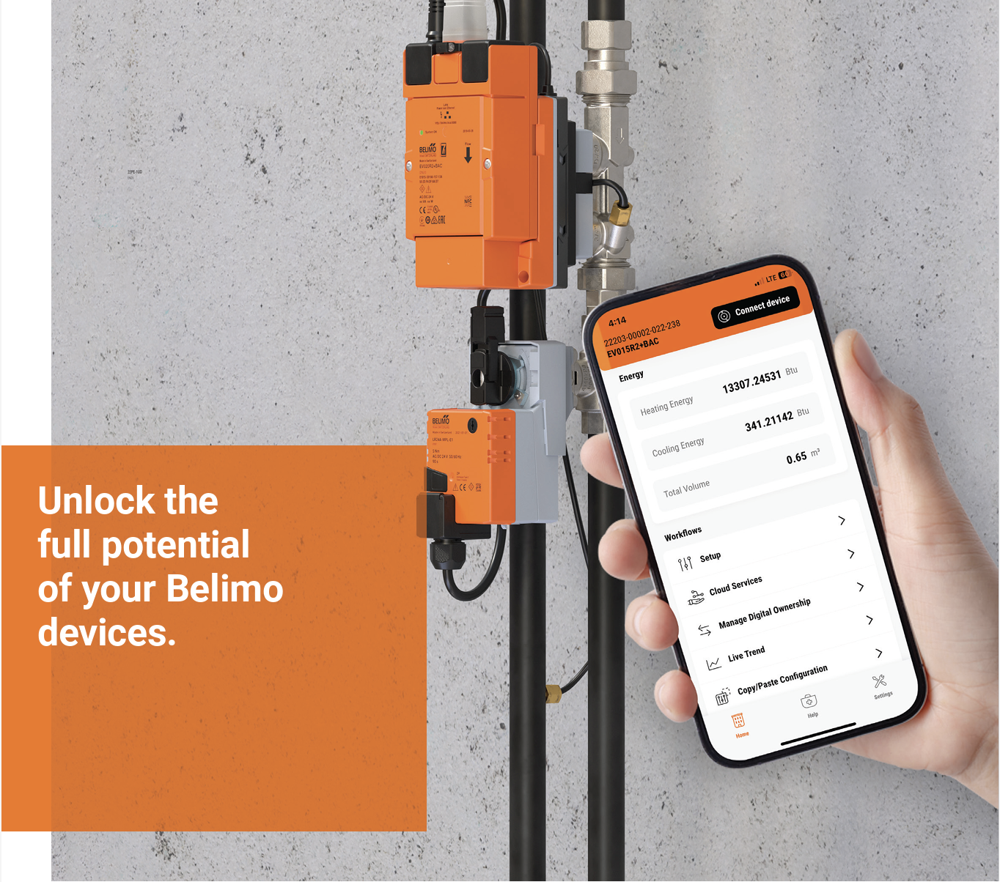
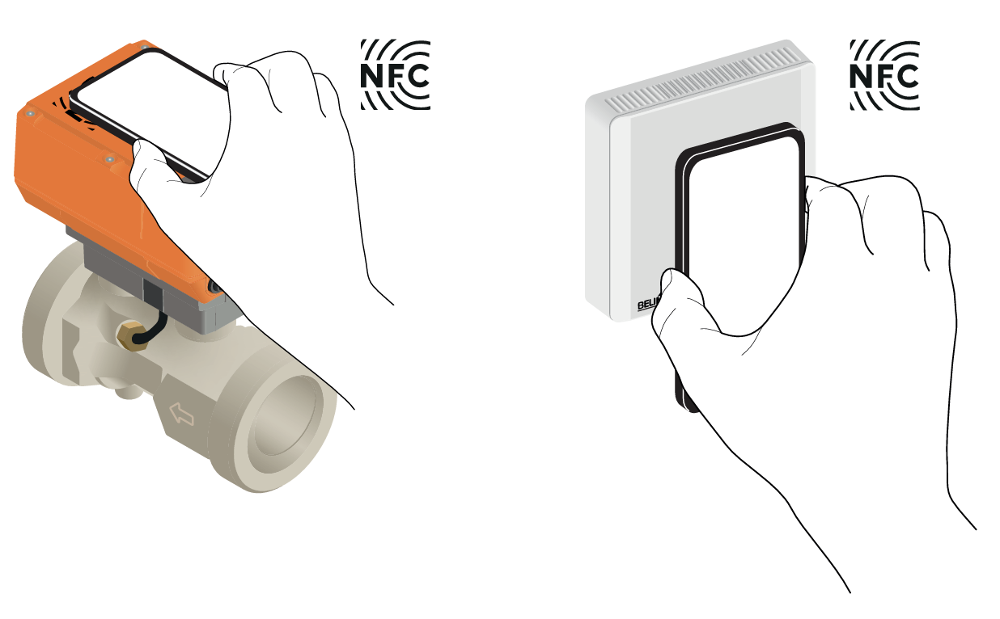
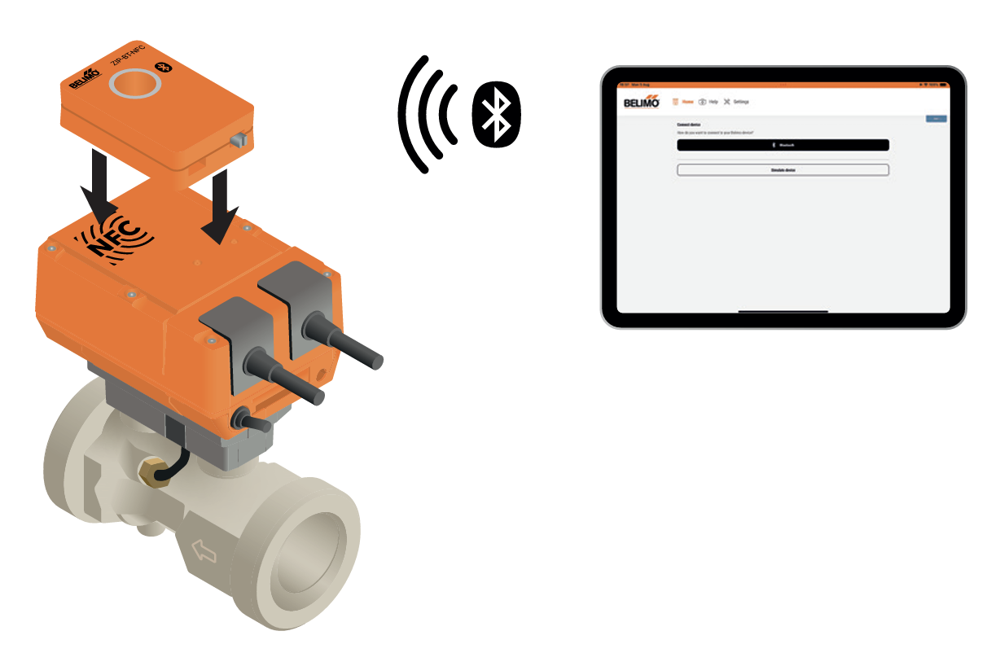
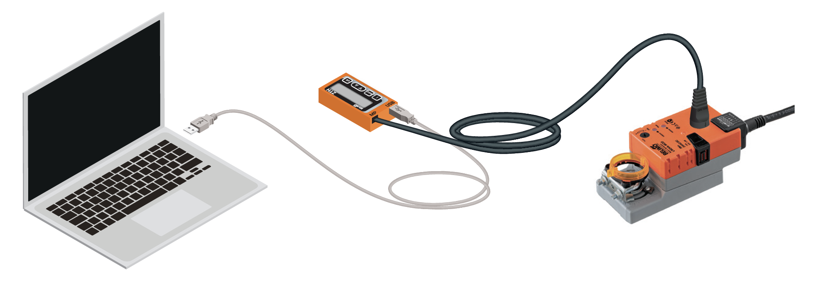
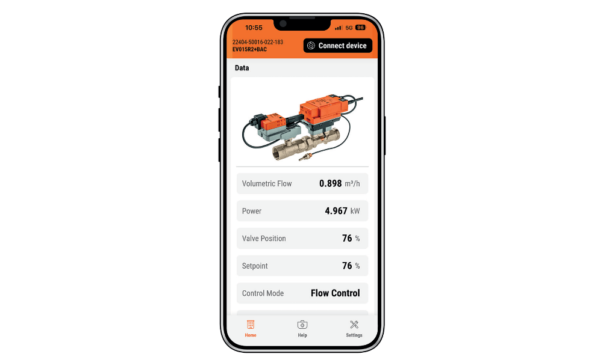
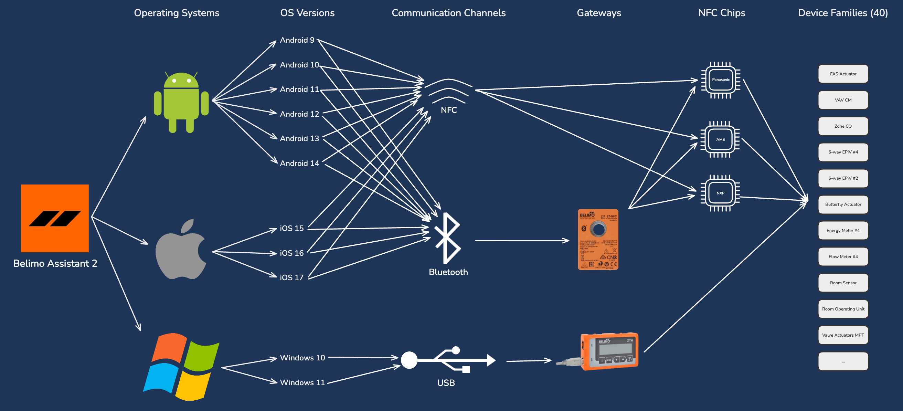
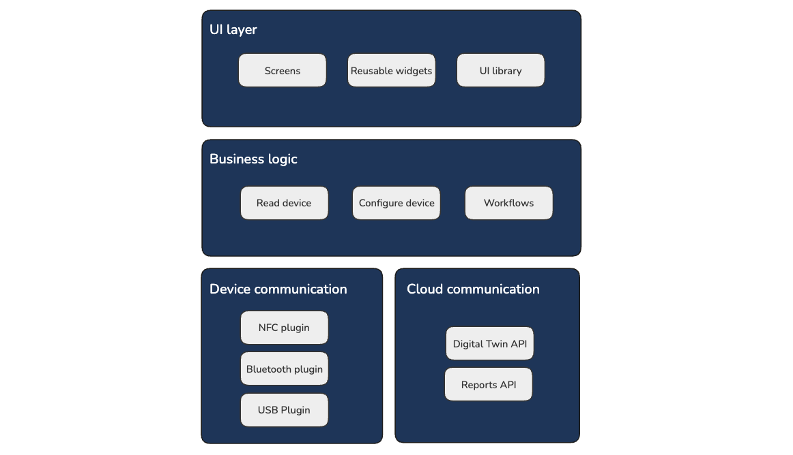
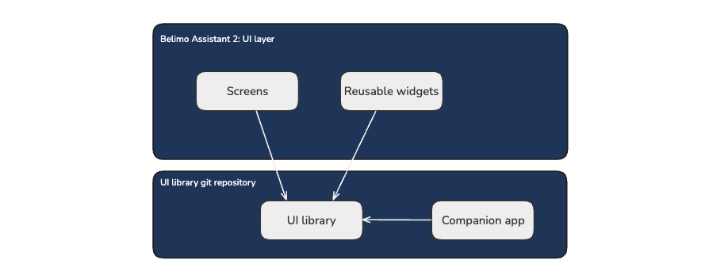
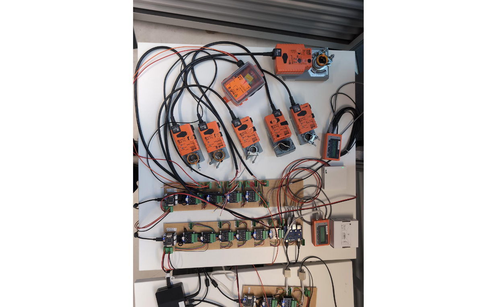

# Belimo and Zühlke: How to with #FlutterInProduction 

Belimo is a global market leader in developing, producing, and selling field devices for energy-efficient control of heating, ventilation, and air conditioning (HVAC) systems. Its core products include damper actuators, control valves, sensors, and meters. Despite its success, Belimo recognised the need to enhance its digital products to offer the best possible experience for its end-users and expand its competitive edge. 

# The Launch of Belimo Assistant 2 

By working together, Belimo and Zühlke realized the [Belimo Assistant 2](https://www.belimo.com/us/en_US/digital-ecosystem/assistant-app) app and brought it to market in 2024. Belimo Assistant 2 is a cross-platform Flutter app for managing the entire lifecycle of Belimo field devices and replaces 3 former software solutions. It enables wired and wireless communication, on-site operation, and troubleshooting of Belimo devices on Android and Apple smartphones, tablets, and even Windows PCs. The app also integrates with the Belimo Cloud to keep the digital twin of each device up to date. 

The core use case of the app is reading and updating the field device configuration via a smartphone or tablet by communicating directly with the field device via NFC or Bluetooth or using the ZIP-BT-NFC Bluetooth to NFC converter.

Windows PCs can connect either directly to a field device or scan the Belimo MP Bus for devices using the Belimo ZTH Gateway. 

After reading the device, the app provides the user with an overview of the most relevant information, the general health of the device, and a predefined set of workflows for specific configurations.  

# Pushing Flutter to its limits 

Among the Flutter apps on the market, Belimo Assistant 2 stands out because of its strong focus on low-level communication with physical devices using proprietary protocols. Flutter was flexible enough to implement Belimo's [MP-Bus 2.0](https://www.belimo.com/mam/europe/technical-documentation/project_planning_notes/belimo_notes-for-project-planning_introduction-MP-bus-technology_en-gb.pdf) technology on smartphones, tablets, PCs on all communication channels - NFC, Bluetooth, and USB. We pushed NFC communication to its timing-limits by using a proprietary NFC tunnel to exchange a few kilobytes of data and allowing the users to resume reading after losing the NFC connection. 

With 40 device families supported by the app, the most significant technical challenge  was the number of combinations that could be used in the field. Starting with the OS the app is running on, the communication channel the user chooses, and the specifics of the Belimo field device, like the NFC chip and the device family. 

All these combinations lead to more than 10’000 ways the app can be used.

# Structure of the app: meeting core requirements 

Three essential requirements guided the app development: 

1. Implementation of Belimo's design system 
2. Reliable and performant device communication 
3. Offline capability while maintaining cloud synchronisation 

To meet these requirements, we implemented a layered architecture consisting of: 
* UI Layer: Screens, reusable widgets, and a UI Library 
* Business Logic Layer: Device configuration and guided workflow components
* Communication Layer: Separate modules for device and cloud communication 

The following sections describe how each layer contributes to fulfilling the non-functional requirements. 

# UI layer: design system and responsiveness 

To comply with the Belimo design system, we have formed a specialised team to develop a UI Library as a standalone package. The team worked independently from the main application development. 

To facilitate rapid design iterations and stakeholder feedback, we created a Companion app - a standalone Flutter application that showcases all UI components available in the UI library.  

This approach enabled quick design iterations and clear communication with stakeholders before implementing components in the main app. 

Making the design responsive was important for Windows PC users who can freely resize the application window.  

To ensure the app layout remains consistent across various screen sizes, we have run a set of UI tests using simulated devices and cloud communication. These tests run on the Windows platform, dynamically adjusting window size to verify the UI's adaptability. 

Early in development, we experimented with golden (screenshot) tests for the UI Library but discontinued this approach due to platform-specific inconsistencies - tests that passed on a Linux build server would fail on Windows and vice-versa, reducing their reliability and maintenance value. 

# Device communication: reliability and performance 

The reliability and performance of the device communication heavily depend on the integration with the OS and how the OS APIs are used.  We have extensively researched the third-party plugins available for NFC, Bluetooth, and USB communication. We evaluated the code quality, number of contributors, and how actively they are maintained and developed several proof-of-concepts. With device communication being the core of Belimo Assistant 2, we wanted to have complete control over the code quality. We have decided to develop our own NFC and USB plugins. For Bluetooth we chose to use the [flutter_reactive_ble](https://pub.dev/packages/flutter_reactive_ble) plugin developed by Philipps. We were satisfied with the active maintenance of the plugin and its quality assurance standards. 

After a solid foundation on the plugin level, further work on reliability and performance required a deep understanding of the proprietary communication protocols and the NFC chip specifics. Luckily, we had extensive documentation on the Belimo side and access to the experts inside the organisation.  

To ensure the quality of the device communication module, we have created a test laboratory setup described in the following section. 

# Test laboratory setup 

Performing automated tests with physical devices is challenging, especially maintaining reliable results without false positives. This becomes even more challenging when testing wireless communication like NFC and Bluetooth. 

With the goal to automate as many tests as possible, we have set up a test laboratory with hardware-in-the-loop (HIL) tests for USB communication. The test laboratory consisted of a laptop connected to multiple devices via USB, with programmatic control over device connections and power supply. The laptop was configured as self-hosted GitHub runner allowing us to run the tests directly from GitHub Actions. While it took several months to stabilise this testing environment, the investment significantly improved our quality assurance process and confidence in the device communication module. 

# Cloud communication: enabling offline operations 

Sometimes, the user of Belimo Assistant 2 works in an environment without internet connectivity. The Belimo devices have their Digital Twin in the cloud, and it was a requirement to update the Digital Twin even when the user has made changes to the physical device while working offline. This required us to develop offline sync, storing the device data in a local database and publishing it in the background once the user returns online.  

The choice of a local database was more complicated than we expected. Some of the most popular database packages, like [Isar](https://pub.dev/packages/isar) and [Hive](https://pub.dev/packages/hive), were abandoned. Others, like [Drift](https://pub.dev/packages/drift) and [sqflite](https://pub.dev/packages/sqflite), were driven by a single contributor. After a proof of concept and a signal from the Flutter community that it will get more contributors, we have decided on Drift. 

Background upload was even more challenging. We have developed a separate executable on Windows that runs parallel to Belimo Assistant 2, acting as a background agent. On iOS, we have experienced the background task often not being prioritised by the OS, requiring us to rely more on the upload when the app is in the foreground. Android was the easiest platform to work with regarding background upload. 

# Conclusion 

Summarising this project, we can say it was challenging due to the complex requirements of low-level device communication, cross-platform compatibility across thousands of potential combinations, and the need for offline capabilities. Implementing proprietary protocols like Belimo's [MP-Bus 2.0](https://www.belimo.com/mam/europe/technical-documentation/project_planning_notes/belimo_notes-for-project-planning_introduction-MP-bus-technology_en-gb.pdf)  technology across NFC, Bluetooth, and USB pushed Flutter to its technical limits. Additionally, ensuring reliability with 40 device families and over 10,000 possible usage combinations presented significant testing challenges. 

We mastered these challenges by developing a layered architecture, creating specialized plugins for critical communication components, establishing a hardware-in-the-loop test laboratory, and implementing robust offline synchronization capabilities. Deep technical expertise and creative problem-solving beyond typical Flutter applications made it even more interesting to the developers. 

The resulting Belimo Assistant 2 app stands out in the Flutter ecosystem as a powerful industrial application that seamlessly bridges physical devices with digital interfaces, delivering a modern and unified user experience that reinforces Belimo's position as a market leader in HVAC control systems. 