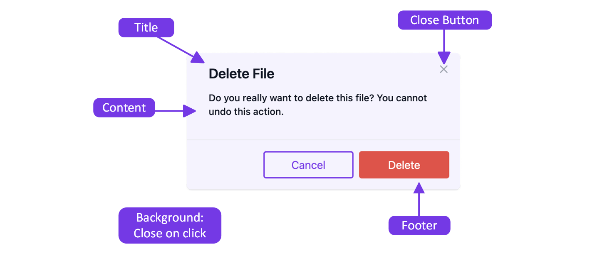

As frontend applications continue to grow and have to cover more use cases, their UI components need to get more flexible. This blog post describes how the requirements for a UI component increase throughout a typical project. We show what problems this entails and how they can be solved with the compound component pattern.

## Exploring the issue by the example of a dialog

We have a React application that can manage files. One feature is to delete files, another is to duplicate them. For both actions, the action should be confirmed with a dialog. Since deleting is a destructive action, we also want to color the delete button red. In such a case, we want to implement a dialog component that we can use for both scenarios. We, therefore, need various parameters to configure the dialog accordingly. The Dialog Component could look like this:

```typescript
<Dialog
  title="Delete File"
  content="Do you really want to delete this file? You cannot undo this action."
  labelActionButton="Delete"
  isDestructiveAction
/>
```

The dialog now looks like this:


The next requirement is to add a renaming dialog, where you can enter the new file name. The content of the dialog does not only consist of text but also contains an input field. We must be able to pass this to the dialog.
Another requirement is to convert documents into images. The confirmation dialog should now have three buttons: "Cancel", "Convert to PNG" and "Convert to JPG". We now need to introduce a third button and make it configurable.
We are only at the beginning of our application and the number of parameters is already starting to get out of hand and there are still many requirements to come.

If we don't want a huge, confusing dialog component that is full of configuration parameters and conditions, we need to take a different approach. One approach that is often chosen, is to implement different subtypes of dialogs. Instead of one dialog, you have multiple dialogs for different use cases. One example could be a ConfirmDialog, a dialog that is exclusively used for confirmations of actions.
Having different dialogs, however, carries the risk that they drift apart and get various looks and feels. There are often so many dialogs that some developers don't know all of them and start introducing new dialogs, even though there is already a dialog for a similar requirement.

This is where the compound component pattern comes to the rescue.

## The compound component pattern

The compound component pattern is a component composition pattern. The aim is to have many small components instead of one large component, all of which require far fewer configuration parameters.
It always takes four steps to implement a compound component:

1. Create a context
2. Create a parent component
3. Create child components
4. Add child components as properties to the parent components

All child components can be combined as desired and have a common context.
The shared context is what makes the pattern so powerful. Not many React developers know and use the pattern. However, the pattern is often used in component libraries as they often require a high level of flexibility. A well-known example is the Headless UI library from tailwind labs.
Let's get started with implementing a dialog component using the compound component pattern. The example will show how the different components are implemented and how the common context is created.

## Implementing a dialog with the compound component pattern

Let's first see what a dialog looks like, what's common with all of them, and what has to be customizable.



* **Title:** The title has always the same font style but the text has to be customizable
* **Close Button:** The close button has to be identical
* **Content:** The content can be completely different
* **Footer:** The footer has always the same style, but the buttons have to be customizable. Not only the the text have to be customizable but also the style, the triggered action, and the number of buttons.
* **Background:** A click on the background should always close the dialog

Before we start, we want to define two principles:

* The style of the component should be the same for all dialogs. The user of the component should not have to worry about it.
* The user of the dialog should not have to worry about the logic for opening or closing it.

Now, let's start with the implementation:

1. We implement the context of the dialog. All child components will have access to the defined properties. In our example, we need to know if the dialog is open or closed and we need the actions to open and close it.

```typescript
// Dialog.tsx

// 1. Create a context
type DialogContextProps = {
  isOpen: boolean;
  open: () => void;
  close: () => void;
};

const DialogContext = createContext<DialogContextProps>({
  open: () => {},
  close: () => {},
  isOpen: false,
});
```

2. We implement a parent component. All following components will be children of this parent component. It creates the context provider and ensures that all children can have access to the same context data.

```typescript
// Dialog.tsx

// 2. Create a parent component
const Dialog = ({ children }: { children: ReactNode }) => {
  const [isOpen, setIsOpen] = useState(false);

  const close = () => setIsOpen(false);
  const open = () => setIsOpen(true);

  return (
    <DialogContext.Provider value={{ isOpen, close, open }}>
      {children}
    </DialogContext.Provider>
  );
};
```

3. Create child components. In our case, we have two levels of child components. The first level includes the component that opens the dialog (mostly a button) and the dialog itself. The second level includes all children of the dialog, like the content or the footer.

Our first child component is the Open component. We add the open action to the child of that component, so the caller only needs to define a UI element that should open the dialog, the open action itself will be triggered by the Open component.

```typescript
// Dialog.tsx

const Open = ({ children }: { children: ReactElement }) => {
  const { open } = useContext(DialogContext);

  return cloneElement(children, { onClick: () => open() });
};
```

The Window component describes the dialog itself and implements the parts of the dialog that are not customizable, like the close button in the upper right corner. The component can receive children like the footer or the content.

```typescript
// Dialog.tsx
// The design is simplified for better readability. The complete code can be found under:
// https://github.com/gabduss/customizable-modal

const Window = ({ title, children }: { title?: string; children: ReactNode }) => {
  const { isOpen, close } = useContext(DialogContext);
  const ref = useOutsideClick(close);

  if (!isOpen) {
    return;
  }

  return createPortal(
    <div id="overlay" className="fixed top-0 left-0 w-full h-full z-1000">
      <div id="dialog" className="top-1/2 left-1/2 rounded-md" ref={ref}>
        {title && (
          <h2 className="fixed left-8 top-4 text-xl font-semibold text-gray-900">{title}</h2>
        )}
        <button
          type="button"
          onClick={close}
          className="text-gray-400 rounded-md text-sm w-8 h-8 ms-auto top-2 right-2 fixed"
        >
          // Close button SVG
        </button>
        <div className="mt-6 mb-16 text-gray-500">{children}</div>
      </div>
    </div>,
    document.body
  );
};
```

The next component we need is the Footer component. This component ensures that all footers look the same and that the elements within are aligned correctly.

```typescript
// Dialog.tsx

const Footer = ({ children }: { children: ReactNode }) => {
  return (
    <div className="fixed bottom-0 left-0 right-0  flex p-4 border-t border-gray-200 rounded-b gap-2 place-content-end">
      {children}
    </div>
  );
};
```

The CancelButton component is a predefined button that already includes the label (that can be overwritten) and the logic for closing the dialog.

```typescript
// Dialog.tsx

const CancelButton = ({ label = "Cancel" }: { label?: string }) => {
  const { close } = useContext(DialogContext);

  return (
    <Button variant="secondary" onClick={close}>
      {label}
    </Button>
  );
};
```

The ActionButton is a button that can be used to execute an action. After the action is executed, the dialog will close automatically.

```typescript
// Dialog.tsx

const ActionButton = ({ label, onClick = () => {} }: { label: string; onClick: () => void }) => {
  const { close } = useContext(DialogContext);

  return (
    <Button
      variant="primary"
      onClick={() => {
        onClick();
        close();
      }}
    >
      {label}
    </Button>
  );
};
```

4. After we define all the child components, we have to assign them to the parent component.

```typescript
// Dialog.tsx

// 4. Add child components as properties to the parent components
Dialog.Open = Open;
Dialog.Window = Window;
Dialog.Footer = Footer;
Dialog.CloseAction = CloseAction;
Dialog.CancelButton = CancelButton;
```

We defined our dialog and can start using it. The following example shows an example of the usage. It includes a button to open the dialog as well as the content of the dialog.

```typescript
// App.tsx

<Dialog>
  <Dialog.Open>
    <Button>Open Dialog</Button>
  </Dialog.Open>
  <Dialog.Window title="Delete File">
    Do you really want to delete this file? You cannot undo this action.
    <Dialog.Footer>
      <Dialog.CancelButton />
      <Dialog.ActionButton
        label="Delete"
        onClick={() => delete()}
      />
    </Dialog.Footer>
  </Dialog.Window>
</Dialog>
```

The dialog offers great flexibility in configuration. You don't have to handle opening or closing the dialog manually. It is easy to add new buttons with different actions and to add your own components. For an additional example featuring an input field, please refer to the following GitHub repository: https://github.com/gabduss/customizable-modal

The StackBlitz example can be found here: https://stackblitz.com/~/github.com/gabduss/customizable-modal

## Conclusion

If you are implementing a React component that requires a lot of flexibility, consider using the compound component pattern. The pattern is particularly useful if you are implementing a component library that is used in different projects. Chances are that the different projects will want to use the components slightly differently. In these case, the compound component pattern helps you to give the necessary flexibility.
