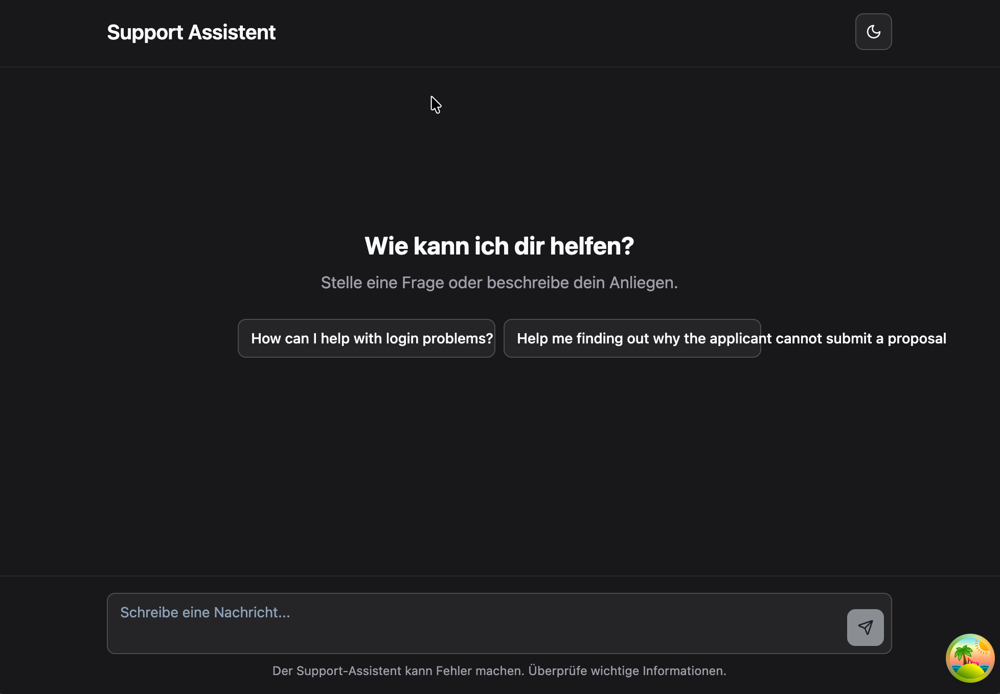
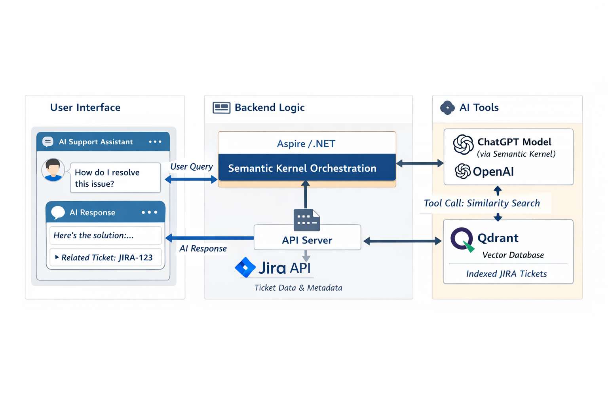

During the project, I noticed that many support tickets were escalated to the development team even though they could have been resolved by first-level support. The necessary knowledge is usually well documented or already captured in previously solved tickets. At the same time, the business often submits the same types of requests repeatedly, even though the answers already exist in their own historical tickets. Yet even for us developers, finding the relevant information in older JIRA issues can be surprisingly difficult and time-consuming.

At NDC Oslo 2024, I was particularly inspired by a talk on practical AI: [“How to add genuinely useful AI to your webapp (not just chatbots)” by Steve Sanderson](https://www.youtube.com/watch?v=TSNAvFJoP4M&list=PL03Lrmd9CiGdnMlwisvEjKClATrAooE2U&index=125&t=2327s). Two years later, during one of our Innovation Sprints, I finally sat down and built a small tool based on the ideas presented in that talk. The solution works in a very similar way to Sanderson’s example and focuses on adding AI where it actually creates value—by helping teams discover and reuse existing knowledge instead of reinventing it for every ticket.



## Architecture Overview

The solution consists of a small web application that sits on top of our existing JIRA support workflow and augments it with AI-powered search. On the frontend, a React application provides a simple chat-style interface where developers and support staff can describe their problem in natural language instead of trying to guess the right JIRA keywords.

On the backend, an Aspire/.NET service uses the Microsoft AI Extensions built on top of the Semantic Kernel library to orchestrate the AI flow. It connects to JIRA to read support tickets, generates vector embeddings for each ticket, and stores them in a Qdrant vector database. Qdrant is responsible for performing fast similarity search over all historical tickets.

When a user sends a message in the chat UI, the backend forwards it to ChatGPT through the Semantic Kernel orchestration. The Qdrant vector database is registered as a custom AI tool, which means the model can autonomously decide when to perform a similarity search. Whenever additional context is needed, the model issues a tool call to Qdrant, retrieves the most relevant historical tickets, and incorporates this information into its response.

This approach allows the model to ground its answers directly in our existing ticket history without requiring any manual retrieval logic on the backend. The result is a truly “cybernetic” assistant that can independently navigate our knowledge base and help the team avoid solving the same issues repeatedly.



## Indexing the JIRA Tickets

All of this only works if the assistant has a good semantic representation of our existing tickets. For that, I added a background job that regularly walks through our JIRA project and writes the issues into the Semantic Kernel memory store, which is backed by Qdrant.

The `JiraIssueIndexService` is triggered as a Hangfire job and processes the issues in small batches:

```csharp
public class JiraIssueIndexService
{
    private readonly IMemoryStore _semanticMemory;
    private readonly ITextEmbeddingGenerationService _embeddingGenerator;
    private readonly Jira _jira;
    private readonly ILogger<JiraIssueIndexService> _logger;

    [AutomaticRetry(Attempts = 0)]
    public async Task IndexIssuesAsync(CancellationToken cancellationToken)
    {
        await EnsureSemanticMemoryCollection(cancellationToken);

        var batchSize = 20;
        var offset = 0;
        int count;

        do
        {
            cancellationToken.ThrowIfCancellationRequested();

            _logger.LogInformation("Indexing Jira issues, offset: {Offset}, batch size: {BatchSize}", offset, batchSize);

            var issues = _jira.Issues.Queryable
                .Where(i => i.Project == "fic")
                .OrderBy(i => i.Created)
                .Skip(offset)
                .Take(batchSize)
                .ToList();

            await IndexIssuesAsync(issues, cancellationToken);

            offset += batchSize;
            count = issues.Count;
        }
        while (count >= batchSize);
    }
}
```

For each issue, the service creates multiple embedding records: one for the summary, several for chunks of the description, and additional ones for the comments. This gives the model fine-grained access to the different parts of a ticket instead of forcing everything into a single giant embedding.

```cs
private async IAsyncEnumerable<MemoryRecord> CreateMemoryRecordsAsync(
    Issue issue,
    [EnumeratorCancellation] CancellationToken cancellationToken)
{
    // Summary
    yield return await CreateMemoryRecordsForSummaryAsync(issue, cancellationToken);

    // Description (chunked)
    var descriptionChunks = await SplitChunks(issue.Description, cancellationToken);
    for (var i = 0; i < descriptionChunks.Count; i++)
    {
        var chunk = descriptionChunks[i];
        yield return await CreateMemoryRecordsForDescriptionChunkAsync(issue, i, chunk, cancellationToken);
    }

    // Comments (also chunked)
    var comments = await issue.GetCommentsAsync(cancellationToken);
    foreach (var comment in comments)
    {
        var commentChunks = await SplitChunks($"{comment.Body.EmptyIfNull()} {comment.Author}", cancellationToken);
        for (var i = 0; i < commentChunks.Count; i++)
        {
            var chunk = commentChunks[i];
            yield return await CreateMemoryRecordForCommentChunkAsync(issue, comment, i, chunk, cancellationToken);
        }
    }
}
```

The `SplitChunks` helper uses `TextChunker.SplitMarkdownParagraphs` from Semantic Kernel to break longer descriptions and comments into smaller pieces before generating embeddings. Each `MemoryRecord` is created with a deterministic ID based on the JIRA key and the part type (summary, description chunk, comment chunk). That makes the job idempotent: running it again will upsert the same records instead of creating duplicates.

Finally, the service batches all `MemoryRecord` instances and upserts them into the Semantic Kernel memory store, which in turn writes them to Qdrant:

```cs
await _semanticMemory
    .UpsertBatchAsync(JiraIssueSemanticSearch.JiraTicketCollectionName, mappedRecords, cancellationToken)
    .ToListAsync(cancellationToken);
```

At this point, all relevant tickets (and their descriptions and comments) are indexed as vectors and ready to be used by the assistant.

## Letting the model drive the tools

The assistant endpoint itself is intentionally quite small. It accepts the chat history from the frontend, adds a system message with instructions, and then lets the model decide when to call the JIRA search tool.

```csharp
app.MapPost("/assistant/chat", async (
    AssistantChatRequest request,
    HttpContext httpContext,
    IChatClient chatClient,
    ILogger<Program> logger,
    CancellationToken cancellationToken) =>
{
    var messages = new List<ChatMessage>
    {
        new(
            ChatRole.System,
            """
            You are an AI support assistant helping support agents at the Fiction Lab for the Fiction Lab Portal.

            When a user asks a question about an existing issue (e.g., support ticket, bug, or story), always use the "searchJiraIssue" tool to find relevant Jira issues.

            ALWAYS justify your answer by citing a search result. Do this by including this exact syntax at the end of your reply:
            <cite searchResultId="12345">short exact quote (max. 10 words)</cite>

            The "searchResultId" must exactly match the "SearchResultId" returned from the searchJiraIssue tool.

            If you cannot find a relevant Jira issue, clearly say so instead of guessing.
            """)
    };

    messages.AddRange(request.Messages.Select(m =>
        new ChatMessage(m.IsAssistant ? ChatRole.Assistant : ChatRole.User, m.Text)));

    var searchJiraIssue = AIFunctionFactory.Create(new SearchJiraContext(httpContext).SearchJiraIssue);

    var executionSettings = new ChatOptions
    {
        Temperature = 0.2f,
        Tools = [searchJiraIssue],
        ToolMode = ChatToolMode.Auto,
        AdditionalProperties = new() { ["seed"] = 0 },
    };

    var streamingAnswer = chatClient.GetStreamingResponseAsync(messages, executionSettings, cancellationToken);
    …
});
```

There are a few important details here:

- The **system prompt** not only sets the context (Fiction Lab Portal support), it also forces the model to use the `searchJiraIssue` tool when working with existing tickets and to always justify its answer with a `<cite …>` tag.
- The `SearchJiraIssue` method is wrapped as a tool using `AIFunctionFactory.Create(...)` and added to the `Tools` collection in `ChatOptions`.
- `ToolMode = ChatToolMode.Auto` tells the model it is allowed to call the tool whenever it thinks it is useful.

The response is streamed back to the UI as a sequence of chunks so the user can see the answer as it is generated.

## The `searchJiraIssue` tool

The tool implementation lives in `SearchJiraContext`. It does three things:

1. Notifies the UI that a search is happening.
2. Uses semantic search over **Qdrant** to find relevant records.
3. Turns those records into a compact JSON structure the model can easily consume.

```cs
[Description("Use this to search for Jira issues by text or issue key.")]
public async Task<object> SearchJiraIssue(
    [Description("Text to search for in Jira issues.")] string searchPhrase,
    [Description("Specific Jira issue key (e.g., USP-123), or null to search all.")] string? issueKey)
{
    _logger.LogInformation("Searching Jira {Issue} issues for phrase: {SearchPhrase}", issueKey, searchPhrase);

    await _semaphore.WaitAsync();
    try
    {
        // Notify the UI we're doing a search
        await httpContext.Response.WriteAsync(",\n");
        await httpContext.Response.WriteAsync(
            JsonSerializer.Serialize(new AssistantChatReplyItem(
                AssistantChatReplyItemType.Search, searchPhrase)));

        // Semantic search via Qdrant
        var searchResults = await _jiraSearch.SearchAsync(issueKey, searchPhrase);

        var issues = new List<(MemoryQueryResult, Issue, IEnumerable<Comment>)>();
        foreach (var r in searchResults)
        {
            var key = GetJiraIssueKey(r);
            var issue = await _jira.Issues.GetIssueAsync(key);
            var comments = await issue.GetCommentsAsync();

            issues.Add((r, issue, comments));

            // Stream each hit to the UI so it can render links
            await httpContext.Response.WriteAsync(",\n");
            await httpContext.Response.WriteAsync(JsonSerializer.Serialize(
                new AssistantChatReplyItem(
                    AssistantChatReplyItemType.SearchResult,
                    string.Empty,
                    Guid.Parse(r.Metadata.Id),
                    key,
                    null)));
        }

        // Return the search results to the assistant
        return issues.Select(r => new
        {
            Key = GetJiraIssueKey(r.Item1),
            SearchResultId = r.Item1.Metadata.Id,
            Summary = r.Item2.Summary,
            Description = r.Item2.Description,
            Comments = r.Item3.Select(c => new
            {
                Author = c.Author,
                Body = c.Body,
            })
        });
    }
    finally
    {
        _semaphore.Release();
    }
}
```

A few noteworthy aspects:

- A `SemaphoreSlim` ensures that only one tool invocation writes to the HTTP response at a time.
- The UI receives both a **“search started”** event and individual search result events `(AssistantChatReplyItemType.Search / SearchResult)`, which it can use to display live feedback and clickable JIRA links.
- The object returned to the model includes the JIRA key, a `SearchResultId` (which the model must use in the `<cite …>` tag), the summary, the description, and all comments (author + body).

The semantic search itself is implemented in `JiraIssueSemanticSearch`, which calls **Qdrant** directly:

```cs
public async Task<IReadOnlyList<MemoryQueryResult>> SearchAsync(string? issueKey, string query)
{
    logger.LogInformation("Searching Jira issues with key {Key} for phrase: {SearchPhrase}",
        issueKey ?? "[null]", query ?? "[null]");

    var embedding = await embedder.GenerateEmbeddingAsync(query);

    var filter = issueKey == null
        ? null
        : new
        {
            must = new[]
            {
                new { key = "external_source_name", match = new { value = $"issuekey:{issueKey}" } }
            }
        };

    var httpClient = services.GetQdrantHttpClient("vector-db");
    var response = await httpClient.PostAsync(
        $"collections/{JiraIssueSemanticSearch.JiraTicketCollectionName}/points/search",
        JsonContent.Create(new
        {
            vector = embedding,
            with_payload = new[] { "id", "text", "description", "external_source_name", "additional_metadata" },
            limit = 3,
            filter,
        }));

    var responseParsed = await response.Content.ReadFromJsonAsync<QdrantResult>();

    return responseParsed!.Result
        .Select(r => new MemoryQueryResult(
            new MemoryRecordMetadata(
                isReference: true,
                id: r.Payload.Id,
                text: r.Payload.Text,
                description: r.Payload.Description,
                externalSourceName: r.Payload.External_Source_Name,
                additionalMetadata: r.Payload.Additional_Metadata),
            r.Score,
            embedding: null))
        .ToList();
}
```

This method takes the user’s query, embeds it, and then asks **Qdrant** for the three most similar chunks from the `JiraTickets` collection. The `external_source_name` payload contains the `issuekey:XYZ-123` tag, which is later parsed back into a real JIRA key with a simple regex so the tool can fetch the full ticket and its comments.

## The UI: streaming answers and live search results

On the frontend I built a small React chat UI that feels similar to modern AI assistants, but is tailored to the Portal support workflow. The `ChatPage` component keeps a list of messages in state, renders them with a `ChatMessage` component, and sends the full conversation to the `/assistant/chat` endpoint whenever the user submits a prompt.

Instead of waiting for the full response, the UI streams the answer as it is generated. The backend writes JSON objects to the HTTP response, so the browser receives a sequence of chunks rather than a single JSON document. There is no direct equivalent to `.NET`’s `IAsyncEnumerable` on the frontend, so I added a small helper that turns the `fetch` stream into an RxJS `Observable<T>`:

```ts
export function fromFetchStream<T>(input: RequestInfo, init?: RequestInit): Observable<T> {
    return new Observable<T>(observer => {
        const controller = new AbortController();

        fetch(input, { ...init, signal: controller.signal })
            .then(async response => {
                const reader = response.body?.getReader();
                const decoder = new JsonStreamDecoder();

                while (true) {
                    const { done, value } = await reader.read();
                    if (done) break;
                    if (!value) continue;

                    decoder.decodeChunk<T>(value, item => observer.next(item));
                }

                observer.complete();
            })
            .catch(err => observer.error(err));

        return () => controller.abort();
    });
}
```

`JsonStreamDecoder` is a tiny stateful parser that buffers partial chunks, detects complete JSON objects based on `{ / }` nesting, and calls `decodedItemCallback` for each object. This lets the UI react to every `AssistantChatReplyItem` as soon as it arrives.

When the user sends a message, `ChatPage` subscribes to this observable:

```ts
const replyItems = fromFetchStream<AssistantChatReplyItem>("/api/assistant/chat", {
    method: "POST",
    body: JSON.stringify(request),
    headers: { "Content-Type": "application/json" },
});

const assistantMessage: MessageState = {
    message: { isAssistant: true, text: "" },
    responseItems: replyItems,
};

setMessages(prev => [...prev, assistantMessage]);

replyItems.subscribe({
    next: (item) => {
        if (item.Type === AssistantChatReplyItemType.AnswerChunk) {
            // append streamed text to the last assistant message
        }
    },
    complete: () => setIsStreaming(false),
    error: () => setIsStreaming(false),
});
```

The `ChatMessage` component then listens to the same `responseItems` observable and updates its internal state based on the item type:

- `Search` → shows a small “Searching for: …” hint under the assistant avatar.
- `SearchResult` → collects the JIRA keys and IDs so the UI can render clickable links.
- `AnswerChunk` → appends text to the assistant message and parses `<cite …>` tags to map citations back to the corresponding search results.

In the rendered bubble I strip the `<cite>` tags from the main text and show the citations as a separate list of “Search results”, each linking directly to the matching JIRA issue. This keeps the answer readable while still making the underlying tickets fully transparent to the support agent.

## From question to answer

Putting it all together, a typical interaction looks like this:

1. The user describes their problem in the chat UI in natural language.
2. The backend forwards the full conversation (plus the system prompt) to the model and registers the `searchJiraIssue` tool in auto mode.
3. The model decides to call the tool, passing the user’s text as the `searchPhrase`.
4. The tool performs a semantic search in **Qdrant**, resolves the matching JIRA issues (including comments), and returns them as structured JSON.
5. The model reads these results, formulates an answer grounded in the existing tickets, and ends its reply with a `<cite …>` element that references one of the `SearchResultId` values.
6. The UI renders both the answer and the corresponding JIRA links, so support agents can immediately jump to the original issue if needed.

This design keeps the orchestration logic very thin: the backend only wires up the tools and streams the updates, while the model itself decides when to search, what to cite, and how to explain the solution.

## Looking ahead

By the time you read this, it’s worth noting that this experiment is already a bit “old” in AI years. The ecosystem around LLMs, tooling, and integration patterns is moving incredibly fast. If I were to build the same assistant again today, I would probably not wire up the tools manually in the backend anymore.

Instead, I would likely expose the JIRA search and vector database as tools via an MCP (Model Context Protocol) server. That would make the integration more modular and reusable: different clients could plug into the same capabilities, and the assistant could discover and use these tools without as much custom glue code. The core idea, however, would stay the same: let AI augment human support work by making existing knowledge easier to find and reuse.

