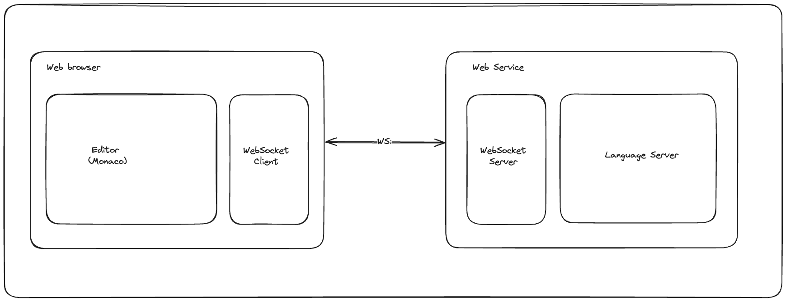
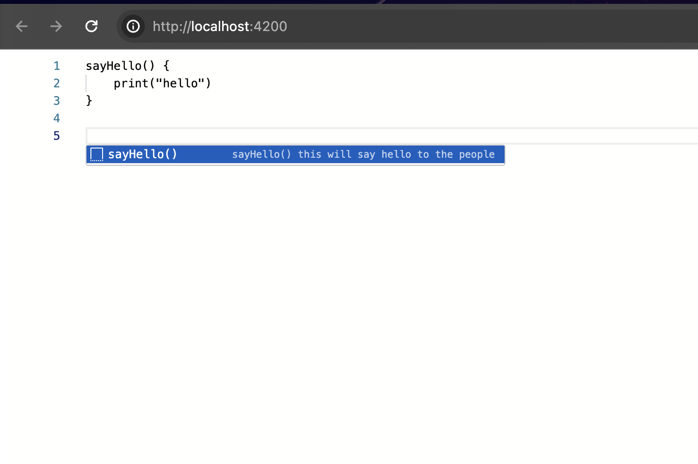

# Create a custom web editor using Monaco and Language Server Protocol (LSP)

If you are developing a domain-specific language or custom language, chances are high that current editors might not support features such as syntax highlighting, diagnostics, and code autocompletion. To enable these features, you need a Language Server Protocol (LSP) and sometimes a custom editor. In this article, we will discuss how to develop a web editor and connect it to a language server using the WebSocket protocol.

To read more about this topic, visit [Develop your own language server](/develop-your-own-language-server/).

### What is Monaco Editor?

Monaco Editor is the code editor that powers Visual Studio Code, known for its performance, rich API, and extensive feature set. It offers:

* Syntax highlighting
* IntelliSense (auto-completion)
* Code navigation (go to definition, find references)
* Multiple language support

### What is Language Server Protocol (LSP) ?

LSP is a protocol used to provide language-specific features in a language-agnostic way. It decouples the editor from the language-specific logic, allowing you to support various languages with minimal effort. LSP offers:

* Syntax checking
* Auto-completions
* Hover information
* Code formatting
* Refactorings

## Implementing the Web Editor using Angular

Let's start developing a web editor for a custom language server.

For this example, we will develop our own mock language server fronted with websocket. Full implementation available at below location

https://github.com/NipunaMarcus/hellols/tree/websocket-launcher

You can find the complete implementation of web editor in below GitHub repo below.

[Angular Webeditor Implementation](https://github.com/cjayashantha/web-editor)

## Prerequisites

Before start, we will be needing below items

* node (v20.10.0)
* npm (v10.2.3)
* Basic knowledge of TypeScript
* Basic knowledge of Angular
* Java (v17)

## Architecture



You can follow below steps to implement the Web editor.

### Step 1: Create New Angular Project

* To create new Angular project, we will be using Angular CLI

```shell
ng new web-editor
```

* Navigate to generated project folder

```shell
cd web-editor
```

### Step 2: Installing Monaco Language Client

The latest version of Monaco Language Client at the time of writing this article is version 8.4.0. With this version, the development team (TypeFox) suggests using their wrapper for the editor instead of directly using the Monaco Editor.

We will be installing the following npm dependencies to add the Monaco Editor and language client.

* [Monaco Language Client](https://www.npmjs.com/package/monaco-languageclient)
* [Monaco Editor Wrapper](https://www.npmjs.com/package/monaco-editor-wrapper)
* [VSCode WebSocket JSON RPC](https://www.npmjs.com/package/vscode-ws-jsonrpc)

```shell
npm i monaco-languageclient vscode-ws-jsonrpc monaco-editor-wrapper
```

After installing all the dependencies, the `package.json` file will look like the example below

```json
{
  "name": "web-editor",
  "version": "0.0.0",
  "scripts": {
    "ng": "ng",
    "start": "ng serve",
    "build": "ng build",
    "watch": "ng build --watch --configuration development",
    "test": "ng test"
  },
  "private": true,
  "dependencies": {
    "@angular/animations": "^18.0.0",
    "@angular/common": "^18.0.0",
    "@angular/compiler": "^18.0.0",
    "@angular/core": "^18.0.0",
    "@angular/forms": "^18.0.0",
    "@angular/platform-browser": "^18.0.0",
    "@angular/platform-browser-dynamic": "^18.0.0",
    "@angular/router": "^18.0.0",
    "monaco-editor-wrapper": "^5.1.2",
    "monaco-languageclient": "^8.4.0",
    "rxjs": "~7.8.0",
    "tslib": "^2.3.0",
    "vscode-ws-jsonrpc": "^3.3.1",
    "zone.js": "~0.14.3"
  },
  "devDependencies": {
    "@angular-devkit/build-angular": "^18.0.2",
    "@angular/cli": "^18.0.2",
    "@angular/compiler-cli": "^18.0.0",
    "@types/jasmine": "~5.1.0",
    "jasmine-core": "~5.1.0",
    "karma": "~6.4.0",
    "karma-chrome-launcher": "~3.2.0",
    "karma-coverage": "~2.2.0",
    "karma-jasmine": "~5.1.0",
    "karma-jasmine-html-reporter": "~2.1.0",
    "typescript": "~5.4.2"
  }
}
```

### Step 3: Create Editor

To keep things minimal, We will use the generated app component files.

Since we are using the Monaco Editor Wrapper, we only need to create a new `div` tag in the HTML file and pass that element to the `MonacoEditorLanguageClientWrapper`.

*app.component.html*

```html
<div #editor class="editor"></div>
```

**Styling**

We will add the following styles to make the editor take up the full height and width of the screen.

*app.component.scss*

```scss
.editor {
  height: 100vh;
  width: 100%;
}
```

*app.component.ts*

```typescript
import { AfterViewInit, Component, ElementRef, ViewChild } from "@angular/core";
import { RouterOutlet } from "@angular/router";
import { MonacoEditorLanguageClientWrapper, UserConfig } from "monaco-editor-wrapper";
import { lsConfig } from "./configs/ls.config";

@Component({
  selector: "app-root",
  standalone: true,
  imports: [RouterOutlet],
  templateUrl: "./app.component.html",
  styleUrl: "./app.component.scss",
})
export class AppComponent implements AfterViewInit {
  @ViewChild("editor")
  editorElement!: ElementRef;

  async ngAfterViewInit(): Promise<void> {
    const wrapper = new MonacoEditorLanguageClientWrapper();
    try {
      await wrapper.dispose();
      await wrapper.initAndStart(lsConfig, this.editorElement.nativeElement);
    } catch (e) {
      console.error(e);
    }
  }
}
```

In the line `wrapper.initAndStart`, you can see that we are passing `lsConfig` as a parameter to initialize the editor.

Below is the minimal configuration that should be passed to the method to connect to the language server using WebSocket.

*ls.config.ts*

```typescript
import { UserConfig } from "monaco-editor-wrapper";

export const LANG_ID = "hello";
export const LANG_EXTENSION = "hello";

const LS_WS_URL = "ws://localhost:8080/ls";

export const lsConfig: UserConfig = {
  wrapperConfig: {
    editorAppConfig: {
      $type: "classic",
      codeResources: {
        main: {
          text: "",
          fileExt: LANG_EXTENSION,
        },
      },
      useDiffEditor: false,
      languageDef: {
        languageExtensionConfig: {
          id: LANG_ID,
          extensions: [LANG_EXTENSION],
        },
      },
    },
  },
  languageClientConfig: {
    languageId: LANG_ID,
    options: {
      $type: "WebSocketUrl",
      url: LS_WS_URL,
      startOptions: {
        onCall: () => {
          console.log("Connected to socket.");
        },
        reportStatus: true,
      },
      stopOptions: {
        onCall: () => {
          console.log("Disconnected from socket.");
        },
        reportStatus: true,
      },
    },
  },
};
```

### Step 4: Introduce Syntax Highlighting

To enable syntax highlighting in the Monaco editor, we need to provide language syntax definitions. You can read more about this in the following [link](https://microsoft.github.io/monaco-editor/monarch.html). We will add an example configuration to support syntax highlighting.

```typescript
import * as monaco from "monaco-editor";

export const syntaxDefinitions: monaco.languages.IMonarchLanguage = {
  typeKeywords: ["boolean", "double", "byte", "int", "short", "char", "void", "long", "float"],

  keywords: [
    "abstract",
    "continue",
    "for",
    "new",
    "switch",
    "assert",
    "goto",
    "do",
    "if",
    "private",
    "this",
    "break",
    "protected",
    "throw",
    "else",
    "public",
    "enum",
    "return",
    "catch",
    "try",
    "interface",
    "static",
    "class",
    "finally",
    "const",
    "super",
    "while",
    "true",
    "false",
  ],

  operators: [
    "=",
    ">",
    "<",
    "!",
    "~",
    "?",
    ":",
    "==",
    "<=",
    ">=",
    "!=",
    "&&",
    "||",
    "++",
    "--",
    "+",
    "-",
    "*",
    "/",
    "&",
    "|",
    "^",
    "%",
    "<<",
    ">>",
    ">>>",
    "+=",
    "-=",
    "*=",
    "/=",
    "&=",
    "|=",
    "^=",
    "%=",
    "<<=",
    ">>=",
    ">>>=",
  ],

  // we include these common regular expressions
  symbols: /[=><!~?:&|+\-*/^%]+/,

  tokenizer: {
    root: [
      // identifiers and keywords
      [
        /[a-z_$][\w$]*/,
        { cases: { "@typeKeywords": "keyword", "@keywords": "keyword", "@default": "identifier" } },
      ],
      [/[A-Z][\w\$]*/, "type.identifier"], // to show class names nicely

      // whitespace
      { include: "@whitespace" },

      // delimiters and operators
      [/[{}()\[\]]/, "@brackets"],
      [/[<>](?!@symbols)/, "@brackets"],
      [/@symbols/, { cases: { "@operators": "operator", "@default": "" } }],

      // @ annotations.
      // As an example, we emit a debugging log message on these tokens.
      // Note: message are supressed during the first load -- change some lines to see them.
      // [/@\s*[a-zA-Z_\$][\w\$]*/, { token: 'annotation', log: 'annotation token: $0' }],

      // numbers
      [/\d*\.\d+([eE][\-+]?\d+)?/, "number.float"],
      [/0[xX][0-9a-fA-F]+/, "number.hex"],
      [/\d+/, "number"],

      // delimiter: after number because of .\d floats
      [/[;,.]/, "delimiter"],

      // strings
      [/"([^"\\]|\\.)*$/, "string.invalid"], // non-teminated string
      [/"/, { token: "string.quote", bracket: "@open", next: "@string" }],

      // characters
      [/'[^\\']'/, "string"],
      // [/(')(@escapes)(')/, ['string','string.escape','string']],
      [/'/, "string.invalid"],
    ],

    comment: [
      [/[^\/*]+/, "comment"],
      [/\/\*/, "comment", "@push"], // nested comment
      ["\\*/", "comment", "@pop"],
      [/[\/*]/, "comment"],
    ],

    string: [
      [/[^\\"]+/, "string"],
      // [/@escapes/, 'string.escape'],
      [/\\./, "string.escape.invalid"],
      [/"/, { token: "string.quote", bracket: "@close", next: "@pop" }],
    ],

    whitespace: [
      [/[ \t\r
]+/, "white"],
      [/\/\*/, "comment", "@comment"],
      [/\/\/.*$/, "comment"],
    ],
  },
};
```

Then we need to update the `languageDef` section in the `ls.config.ts` file by setting the `syntaxDefinitions` into the `monarchLanguage` property as shown below:

```typescript
  languageDef: {
    languageExtensionConfig: {
      id: LANG_ID,
      extensions: [LANG_EXTENSION],
    },
    monarchLanguage: syntaxDefinitions,
  },
```

After adding the language syntax definitions, the final configuration file will look like the example below:

*ls.config.ts*

```typescript
import { UserConfig } from "monaco-editor-wrapper";

export const LANG_ID = "hello";
export const LANG_EXTENSION = "hello";

const LS_WS_URL = "ws://localhost:8080/ls";

export const lsConfig: UserConfig = {
  wrapperConfig: {
    editorAppConfig: {
      $type: "classic",
      codeResources: {
        main: {
          text: "",
          fileExt: LANG_EXTENSION,
        },
      },
      useDiffEditor: false,
      languageDef: {
        languageExtensionConfig: {
          id: LANG_ID,
          extensions: [LANG_EXTENSION],
        },
        monarchLanguage: syntaxDefinitions,
      },
    },
  },
  languageClientConfig: {
    languageId: LANG_ID,
    options: {
      $type: "WebSocketUrl",
      url: LS_WS_URL,
      startOptions: {
        onCall: () => {
          console.log("Connected to socket.");
        },
        reportStatus: true,
      },
      stopOptions: {
        onCall: () => {
          console.log("Disconnected from socket.");
        },
        reportStatus: true,
      },
    },
  },
};
```

### Step 5: Starting up the language server and web editor

Starting the language server

```shell
java -jar target/hellols-0.0.1-SNAPSHOT.jar
```

Starting the Angular application

```shell
ng serve
```

below is the final look.



Happy Coding!

**Next**

* [Develop a Web Editor With React and Monaco with Language Server support](/develop-a-web-editor-with-react-and-monaco-with-language-server-support/)

**Previous**

* [Develop your own language server](/develop-your-own-language-server/)
