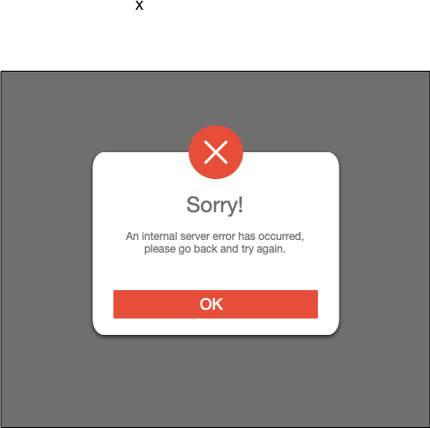
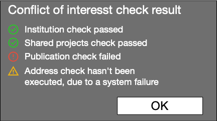

Error handling is rather neglected in software projects and is more of a minor matter. No wonder, as it is much better to concentrate on business value and features. Unfortunately, this can be very annoying for users. Even worse, it can end in disaster.

> In August 2013, Google experienced a five-minute outage, resulting in an estimated loss of $545,000 in revenue. Users were unable to perform searches or access other Google services during that time.

Or a similar example.

> In 2013, Amazon faced issues with its online retail system during a one-hour outage, potentially causing a loss of $66,240 per minute. The total estimated loss was around $3.85 million.

As we have seen, even one single minute of downtime can cost a fortune or have legal implications.
Yes, of course, my examples are about very big, well-known companies. You might think this does not concern you and your software projects. **You are wrong.** Most public-facing applications have a monetary or legal aspect.

## Design for failure

First I want to talk about the current situation. At this point, we might have realized that proper error handling is important. In reality, unfortunately, the implementation usually looks very poor.

We know all those little error popups thrown into our faces when an error has occurred in the application. Sadly, this is common practice in most applications. Exceptions bubble up to the frontend, get displayed in an error dialog and nothing works anymore. And be honest, most likely you implemented such an error dialog as well.

But why is this such a common pattern? I actually can't blame the developers, or at least not for implementing it. The problem is located way deeper in the system. The entire team, from the developers to POs, BAs and UX engineers, is focused on designing and delivering features. We all strive for a cool and user-friendly product, the timeline is short and features should rather be released yesterday than tomorrow. In addition, not all are aware of errors that can occur. At least I haven't seen any UX engineers thinking about it on their own. So nobody is thinking about it and providing the dead-end error dialog is the final resort the developers have.

And that's why we need to sit together as a whole team. **Making everyone deeply aware of failures that can occur and bake error handling in**. We need to design error handling in the system and define how it should behave in every single scenario.

## Keep the lights on

I have been talking about the root cause of missing proper error handling. The question remains, what can we do to prevent these error dialogs? There are some cases when nothing works anymore but in many cases, we can handle them and keep the application running.

It is better to degrade the functionality of an application than let it stop working. It is important to inform the user about the misbehavior, but let them keep doing their work within the limits of what is still possible. This way the user can make their own decisions on how to proceed.

Let's give some examples:

We display some personal information in our app and resolve the person's address from an external address service. When this service returns a failure or is unreachable we can display the information about the occurred failure to the user.

This way, the user knows that the system currently has a problem, but it is possible to continue working as long as no functionality using the address service needs to be used. Maybe it can be done later when it is working again.

Another example could be a feature where several checks get executed. Let's say our software checks 'conflicts of interests' between multiple people. It checks different constraints such as whether the respective people are working in the same institution or have worked on a shared project etc. The data gets collected from different APIs and each check result gets displayed so that the user can decide whether a person is suitable or not. Now let's assume one of the services providing check-related data is currently not working. We can encapsulate this failure and still show the check results of all working services and we inform the user that a certain check could not be executed due to some failures.

Again, this way the user can decide whether it's safe to still go on with this person or not.

There are many ways how we can handle errors with feature degradation. It is not always easy to find a way, but I would argue that in most cases it is possible! Just be creative and involve the entire team.

To end the article I would like to recommend you one of my favorite books about failure handling: [Release It!](https://www.amazon.de/Release-Production-Ready-Software-Pragmatic-Programmers/dp/0978739213?language=en_GB\&currency=EUR)

## Summary

System downtime can cost a fortune or have legal impacts. But usually, we are focused on feature delivery. Leading to a general error popup developed by the software engineers. Applications must be designed for errors as well, so we must include the whole team in that process. It is better to handle errors and degrade some functionalities instead of letting the application stop working.

What is your opinion? Share your thoughts down below in the comments section.
