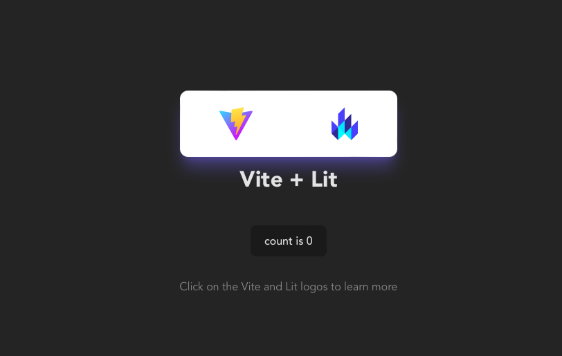
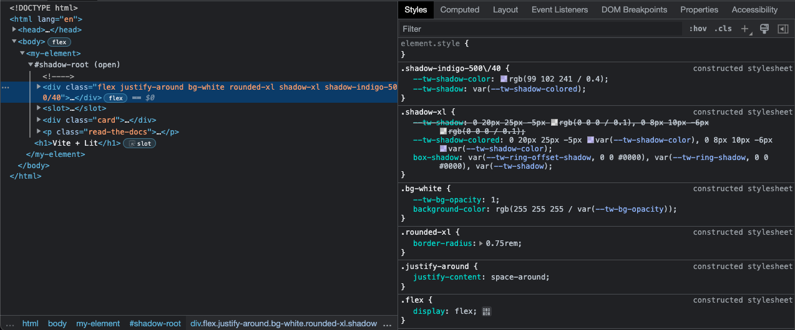

We recently wanted to use tailwindcss to help developers at one of our customers create maintainable
and scalable styling. At the same time we were creating web components for a design system. This
raises one big issue with tailwind since we were going to use ShadowDOM. This will prevent globally
available tailwind utility classes to be available in our components. But with LitElement we found a
good way to get the best of both worlds without having to disable ShadowDOM!

The source code referenced in this post can be
found [on GitHub](https://github.com/r3dDoX/lit-tailwind-integration).

## The problem with ShadowDOM

One of the basic promises of web components is the boundary that prevents styles from the outside
leaking into the component. This is achieved with the introduction of the ShadowDOM, you can read
more about it on
[MDN](https://developer.mozilla.org/en-US/docs/Web/Web_Components/Using_shadow_DOM). This way we can
write web components that look the exact same way wherever they are used. The downside of this is
our own global styles will also have no option to "pierce" through the ShadowDOM.

There is options to allow specific elements in our web components to receive styling from the
outside like [::part](https://developer.mozilla.org/en-US/docs/Web/CSS/::part) but this does not
work for general styles that should be assignable on every element we want. So we need to come up
with a way to have tailwind utility classes in each of our components without having to copy them.
Let's get started!

## Setup

First off we want to have an easy and fast setup. We found lit and vite to be a great combination,
so I'm going to start with the vite template found [in their guides](https://vitejs.dev/guide/):

```bash
npm create vite@latest lit-tailwind-integration --template lit-ts
```

This will set up a basic lit app with vite as our bundler and dev server. Next we need the setup for
tailwind. I'll just install it like tailwind
recommends [in their docs](https://tailwindcss.com/docs/guides/vite#vue):

```bash
npm install -D tailwindcss postcss autoprefixer
npx tailwindcss init -p
```

Before we look at the configuration lets have a look at what we got so far. We start with one
component `my-element.ts` that has component-specific styling in the static `styles` property. Next
to this we also have an `index.css` providing global styles for our page. All of these files get
loaded in the `index.html` and that is already everything for our app. The rest is configuration and
assets.

## Importing tailwind

To make tailwind include its classes we need to import their directives somewhere. If we just import
them in the `index.css` the ShadowDOM will protect our component from getting the styles. So we need
to find another solution. Earlier I mentioned the static `styles` property giving us
component-specific styles. This property can be leveraged to contain an array of styles.
See [lit documentation](https://lit.dev/docs/components/styles/). Let's try this out with
a `global.css` that we can import and pass to lit. This way lit can take care of linking it properly
and making sure it is not duplicated for each component.

```css
/* global.css */
@tailwind base;
@tailwind components;
@tailwind utilities;
```

To import this css we will use a vite-specific import flag, but importing css can be solved in any
bundler with ease.

```typescript
import globalStyles from './global.css?inline';
```

Like this, we will get the whole CSS as a plain string in the variable `globalStyles`. Now to add
them to the array of styles we need this CSS to be a `CSSResult`. Thankfully lit provides a method
to parse CSS as plain string called `unsafeCSS`. Since we load our own CSS file and do not import
or evaluate any user input here, we are safe.

```typescript
@customElement('my-element')
export class MyElement extends LitElement {
  static styles = [
    unsafeCSS(globalStyles),
    css`[existing component styles]`,
  ]
}
```

To finish it off we need to tell tailwind which files will contain tailwindcss classes. We do this
in `tailwind.config.cjs` by extending the content array:

```javascript
module.exports = {
  content: [
    './src/**/*.ts',
  ],
  theme: {
    extend: {},
  },
  plugins: [],
}
```

## Testing it out

To properly test it we need to use some tailwind classes. Let's just add some to one of our
containers inside the component:

```html

<div class="flex justify-around bg-white rounded-xl shadow-xl shadow-indigo-500/40">
    <a href="https://vitejs.dev" target="_blank">
        
    </a>
    <a href="https://lit.dev" target="_blank">
        
    </a>
</div>
<slot></slot>
<div class="card">
    <button @click=${this._onClick} part="button">
        count is ${this.count}
    </button>
</div>
<p class="read-the-docs">${this.docsHint}</p>
```

Let's run the app and go check the browser!



Beautiful!

## But how does it work?

The magic keyword is "constructable stylesheets". If you haven't heard of this yet, before lit I
didn't either. But here's a great blog post about how they work:
[constructable stylesheets](https://web.dev/constructable-stylesheets/).

The dev tools also help us by showing `constructed stylesheet` next to classes that originate from
one of these.



This way lit can use these stylesheets and reference them in the components. This means we will now
have one constructed stylesheet with all the tailwind classes that have been found in our code which
gets referenced in every component where we add it to the static `styles` property. Neat!
