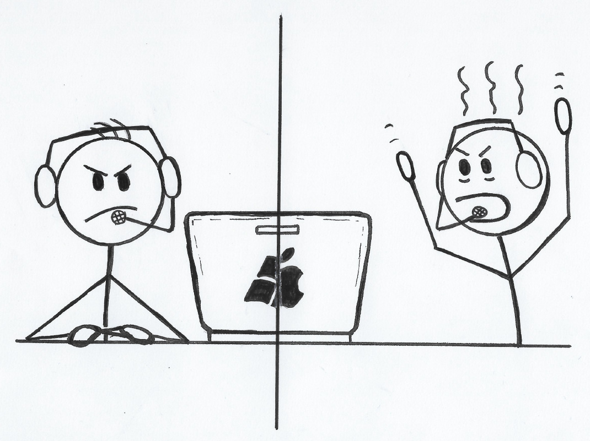

Pair programming is a powerful tool in the software development process, but like any tool, it comes with its own set of challenges.
From feeling overwhelmed by a partner’s pace to navigating the complexities of remote collaboration, I’ve experienced a range of obstacles in my pair programming journey.
But through trial and error, reflection, and a deep dive into the subject, I’ve gained a better understanding of its intricacies.
In this blog post, I’ll share some of the mistakes I made along the way and the lessons I learned, so you can avoid them and make the most out of your pairing sessions.
Whether you’re a seasoned developer or a newcomer to the field, I hope my experiences provide some food for thought.
Let’s get started!

## Pair programming mistakes I made, so you don't have to

I recently felt that I'm missing out on a lot of potential when pair programming.
Identifying the exact issue was not immediate, but there was a clear sense that things could be better.
When I dived into the topic, I realized that the pair programming skill follows the [Bushnell's Law](https://en.wikipedia.org/wiki/Bushnell%27s%5FLaw).
While it's easy to understand the main concepts like driver - navigator, pair programming is a difficult topic to master.
If you're interested in the theory of pair programming , I can highly recommend the article ["on pair programming" from Martin Fowler's blog](https://martinfowler.com/articles/on-pair-programming.html), it provides an excellent entry to the topic.

As a prelude, I see pair programming as people's business and it is therefore highly subjective.
The following examples are based on my own experiences and how I feel about them.

## Overwhelmed by the Driver's Pace

In the early days of my programmer career, I found myself working with another newcomer in the team.
Since we didn't know each other and were both new to the project, our collaboration was especially complex.

Our roles were clearly defined - he was the driver, I was the navigator.
As we ventured into the new project and environment, I found his pace challenging to match.
Since he was already a senior, he was swift in his actions, and I often found myself trailing behind, struggling to keep up.

My unfamiliarity with him and the fear of appearing less competent held me back from asking him to slow down.
This was further complicated by his eagerness to showcase his skills.

Looking back, the solution to this problem is simpler than it seems.
It’s crucial to remember that it’s okay not to know everything and that it’s encouraged to ask questions.
It’s also about acknowledging the presence of [imposter syndrome](https://en.wikipedia.org/wiki/Impostor%5Fsyndrome) and fostering open communication.
After all, pair programming is as much about learning as it is about coding.
Effective communication forms the backbone of successful pair programming, making it a rewarding experience for both parties involved.

## Guiding a Junior

I recently had the situation where I pair programmed with a junior developer who had just joined our team.
As a more experienced developer, I took on the role of the navigator while the junior was the driver.
Understandably, he was nervous because he was new to the team.
During our pairing session, I provided many tips and tricks to the junior, particularly on how to navigate within the IDE.
However, I noticed that our progress slowed down significantly during our working session.

In retrospect, I realized that I had unintentionally overwhelmed him.
Eager to show his appreciation for my provided tips and tricks, he tried to apply all my suggestions instantly.
His focus shifted entirely to mastering IDE shortcuts and therefore diverting his attention away from the actual problem we were trying to solve.

Pair programming is an excellent opportunity for knowledge sharing, but it’s crucial that this exchange happens in digestible bites, not all at once.
This is especially important when pairing with someone who is eager to improve and prove themselves. In this particular example, I should have told him the IDE shortcuts at the end of our pairing session.
Since then, I learned to prioritize establishing a trusting relationship where it’s okay to fail and to not know everything.
Additionally, aside from building a trusting dynamic, it's important to establish an environment where asking questions is encouraged.
By asking questions, your partner can better understand where you are in your thought process.
Sometimes, you have assumptions about what your partner knows or what they are thinking, and asking questions is perfect for quickly getting on the same page.
This approach is especially beneficial when working with someone new to the team, as it helps alleviate their nervousness and allows them to focus more on learning and problem-solving.

## The Trap of No Breaks

Despite being aware of the importance of breaks and switch-ups, I often find myself falling into the trap of continuous pairing.
When [I’m in the flow](https://en.wikipedia.org/wiki/Flow%5F\(psychology\)#:~:text=The%20flow%20state,abilities.%22%5B4%5D), time and the need for rest seems to slip away unnoticed, which also happens often when pairing.
The driver does not switch with the navigator after a committable segment, and we continue to push forward. Contrary to popular belief, [being in the flow isn’t always advantageous](https://en.wikipedia.org/wiki/Flow%5F\(psychology\)#:~:text=In%20some%20cases,on%20attentional%20abilities.), since it can lead to fatigue and overworking.
I noticed that, when we are tired, the quality and quantity of our communication rapidly decreases.
We all start to think about our own problem and ignore our partner, or we are stuck on the wrong problem, a phenomenon known as the [XY problem](https://en.wikipedia.org/wiki/XY%5Fproblem).
This significantly reduces our productivity and may even render us ineffective.

The key in avoiding this trap is to remember to take regular breaks, switch roles and ensure effective communication at all times.
This not only helps to keep our minds fresh but also ensures that we are on the same page throughout the whole session.

## Remote Pairing under Non-Ideal Conditions

There was an instance when a colleague and I attempted to pair program remotely.
Initially, we experienced minor delays, but over time they became significant, causing us frustration and irritation.
However, not wanting to constantly complain, we tried to cope with the situation.

Unfortunately, the delay made it nearly impossible to follow the driver’s actions, and we eventually had to stop the pairing session.
This experience underscored the importance of having an excellent setup and a high-quality internet connection for remote pair programming.
Even minor issues can become major distractions, diverting focus from the task at hand.

If given the choice, it’s preferable to pair program in front of the same screen.
But if remote pairing is necessary, ensuring a low-latency high-quality internet connection is paramount to a successful and productive session.

## Concluding Thoughts

The effectiveness of pair programming is tremendously influenced by soft skills and the dynamics between the two individuals involved.
Factors such as personality traits (introvert vs extrovert), experience levels (junior vs senior), and familiarity with each other (new to the team vs well-acquainted) can have a monumental impact on the quality and productivity of the pairing session.

It’s essential to adjust the focus of the pairing session depending on the circumstances.
For instance, if the pair programmers are not well-acquainted with each other, the initial focus should be on establishing a good dynamic and trustworthy relationship.
Furthermore, it’s crucial not to overwhelm a (junior) developer with too much information at once, whether it’s project specifics, domain knowledge, or IDE shortcuts.
Information should be shared in digestible chunks to ensure effective learning and application.
Another important aspect of each pairing session is the ability to say "I don't know".
Asking questions and an open communication is crucial for fostering a good environment where people can thrive in.

In conclusion, pair programming, despite its challenges, is a valuable practice in software development.
It promotes collaborative problem-solving, continuous learning, and high-quality software development.
By embracing the challenges during paring sessions and reflect on them, developers can continually improve their pair programming skills.
Share your stories and tips in the comments to help us all learn and grow together. Happy pair programming!
