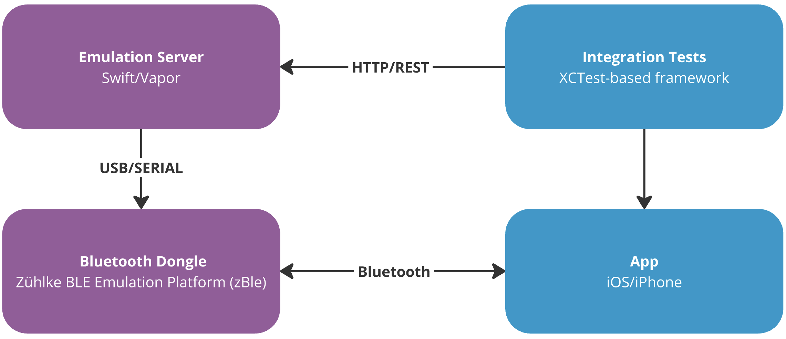
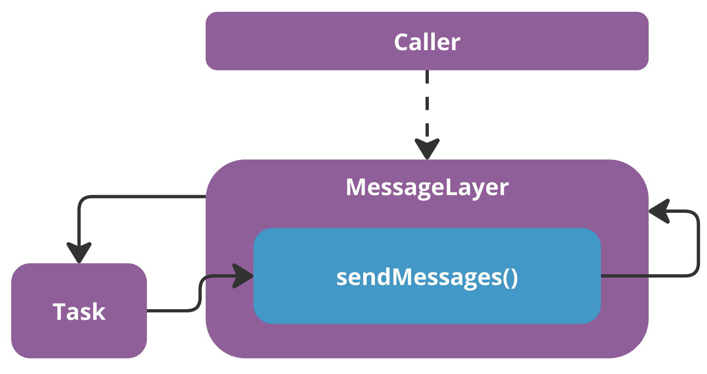

In a recent project, we observed one of those bugs that lets every developer jubilate. It was only happening rarely and seemed to manifest in varying ways.

But first, some context: We were running a Swift/Vapor server which controls a generic Zühlke Bluetooth emulation dongle (connected via USB) in order to emulate medical devices. This talks to an iOS app via Bluetooth (running on a real phone) that is under test by a custom (medical) XCTest-based test framework. In summary, quite some moving parts.



When executing tests in sequence (i.e. not individually), they would sometimes fail because of a Bluetooth communication failure. Curiously, most messages were still transmitted successfully. After some digging, we realised that on failure, the tests that executed *before* had one thing in common: they terminated the connection forcefully. This was fine by itself but led us to think that somehow the tests were not executed in isolation.

We were now looking at the server logs across test-executions and realised that we couldn’t match the failed transmission to calls made in the current test. So maybe it was a transmission from an earlier test… but why would it still be executing? At this point we narrowed the problem down to a single class/function. It looked something like the following (very simplified):

```swift
class MessageLayer {
    var task: Task<Void, Never>?

    init() {
        task = Task { [weak self] in // 1.
            try? await self?.sendMessages(2)
        }
    }

    private func sendMessages(_ messages: Int) async throws {
        for i in 0...messages {
            print("Sending: \(i)")
            try await Task.sleep(for: .seconds(0.5)) // 2.
        }
    }

    deinit {
        print("Deinit")
        task?.cancel() // 3.
    }
}

var messageLayer: MessageLayer? = MessageLayer()
messageLayer = nil // 4.
print("End of test")
```

1. When the class is initialised, a new background `Task` is spawned to send messages
2. Sending messages takes some time
3. When the class is deallocated, we stop the background `Task`
4. We pretend the Bluetooth connection terminates and we remove all references to the `MessageLayer`

When you execute this code, you will see the following log output (or similar):

```text
Sending: 0
End of test
Sending: 1
Sending: 2
Deinit
```

As you can see, the sending continues even though the test has already finished. This unintended extension of object lifetime is something we commonly see with retain cycles (hence the name of this post).

However, here we are simply in the middle of executing a method on the `MessageLayer` which prevents it from being deallocated. This in turn prevents our task cancellation logic (3.) from stopping exactly the method execution that is keeping the object alive. There we have our cycle.



In the real project, the `Task` iterated over an `AsyncSequence` that acted as a message queue (that’s why we needed it in the first place) and the `sendMessage` method implemented a timeout mechanism that reported a failure after 750ms. Since the connection of the preceding test was force-terminated, the message-sending never finished, keeping the `MessageLayer`  alive, which in turn resulted in the timeout being triggered while the next test was already executing.

Now let’s talk about solutions.

## Solution #1: Cancel the task

The simplest option is to cancel the task from the outside before removing the reference to the `MessageLayer`. By adding `messageLayer?.task?.cancel()` before (4.) above we achieve the desired behaviour:

```text
Sending: 1
Deinit
End of test
```

No delayed deallocation. Unfortunately, this requires users of the `MessageLayer` to remember cancelling the task. This is not very intuitive and requires internal knowledge of the `MessageLayer` — not great.

## Solution #2: Remove self-reference

Another option is to make `sendMessages` static (or even put it outside the class). This removes the (implicit) reference to `self`  and allows the object to be freely deallocated (in turn cancelling the `Task`).

This requires us to pass in all `MessageLayer` state the method needs, now that it has no access to `self` anymore. We just need to be careful to not cause a classical retain cycle when doing so.

Here’s the code, still resulting in the same output as in solution #1:

```swift
class MessageLayer {
    private var task: Task<Void, Never>? // private now

    init() {
        task = Task { // Be careful to not capture self here strongly
            try? await Self.sendMessages(2) // Self instead of self
        }
    }

    private static func sendMessages(_ messages: Int) async throws { // static
        for i in 1...messages {
            print("Sending: \(i)")
            try await Task.sleep(for: .seconds(0.5))
        }
    }

    deinit {
        print("Deinit")
        task?.cancel()
    }
}

var messageLayer: MessageLayer? = MessageLayer()
messageLayer = nil
print("End of test")
```

The nice thing is that the background task management is completely self contained and consumers of the `MessageLayer` can just use it without a second thought.

## Wrap Up

As you can see, it is quite simple to inadvertently extend the lifetime of objects with long-running async functions. We implemented solution #2 to solve our issue successfully.

We hope we saved you some hours of debugging and that you enjoyed diving into this issue as much as we did. If you can avoid spawning a new `Task` altogether, you never run into this problem. That’s obviously preferred. However, in case you cannot get around it, you now have a solution at hand.
