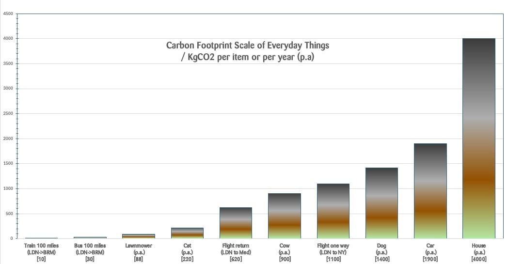
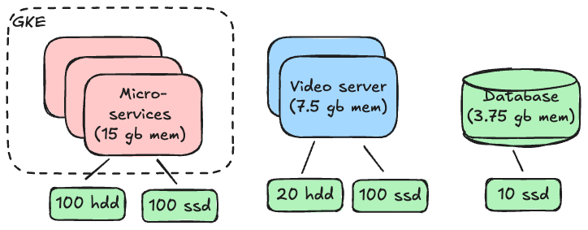
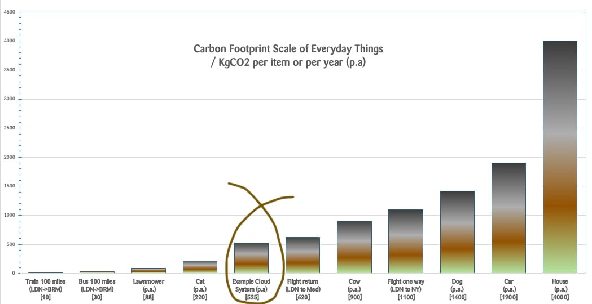
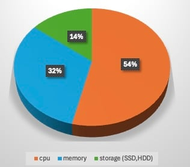

# Coding for a Greener Future: Actions for Big Impact

## Introduction

We all make decisions that impact the future of our planet, from our choice of food and consumer products
to transport options for commuting or holidays.
In doing so we have become accustomed to the notion of a carbon footprint and the target of carbon neutrality.

**How can we apply this thought process to the software that we produce?**

This article provides guidance on activities as software engineers that we can perform today;
to reduce carbon usage and make our contribution towards a greener future.

It begins with a contextual review of the relative cost of carbon footprints for everyday things and proposes
some practical activities we might take to reduce the footprint of our software,
something of which our customers are increasingly business-conscious.

### Not in Scope

Our focus is on the carbon cost of systems that run our software, and we highlight just a few of many worthwhile patterns that are applicable.
Although we touch lightly on many topics, intentionally out of scope is the way in which cloud providers account for their carbon footprints.
Also note that the relative carbon footprints of everyday things are necessarily a guideline only.

## What is ‘carbon cost’?

First, let's define some terms and set the context.

We will use the carbon cost of some popular everyday things so that we can understand the relative cost of common software components.
For this we’ll use the standard unit of Kg of carbon dioxide (KgCO2).
Note that for greenhouse gases other than CO2 it is common practice to convert to CO2 as an equivalent.



*Figure: Carbon Footprint Scale of Everyday Things*

In this chart we show some examples of everyday carbon footprints; from the lowest footprint of 10 KgCO2 for a train journey London to Birmingham, and
similar for a bus at 130 KgCO2, scaling up to the cost of a petrol lawnmower for 22 mows/year, some example flight costs, the well-publicised methane production of cows and car ownership, the staggering cost of our companion pets and the energy cost for a house.

Some details behind these numbers: the cost of a house represents an average UK gas-fired heating with grid electricity.
The cow is calculated as methane produced per year and uses standard conversion to CO2. Costs of transport are factored for one person journey, whereas costs showing 'p.a' represent 1 year.
Cost of ownership of cats and dogs represent their whole-ownership life-cost factored for one year. Source references are provided at the end of this article.

### Aside: How much is 1kg of CO2?


*Figure: A 1m balloon of 1kg CO2*

As an aside, to picture 1Kg of CO2 imagine a balloon of approximately 1m diameter, at 18 degrees temperature and at sea level.

## How do we measure?

To calculate an equivalent carbon cost of software solutions deployed to the cloud, we must consider the triad of compute, memory and disk.
We will ignore the embedded cost of hardware because cloud providers include that in the rate.
Note that if we wish to measure for physical hardware solutions such as on-premise data centres or a Mac or laptop, of course we need to factor in the embedded carbon cost.

There’s plenty of controversy over climate reporting, with some cloud providers reputed to adopt clever accounting methods to obfuscate the true carbon cost.
There are some key omissions which force us to guess some aspects, such as whether AWS S3 storage is based on physical hard drives, or how long a Lambda function remains in memory.

Fortunately there are a growing number of third-party sources which help us see the ‘wood for the trees’;
one such is ClimateIQ which provides emission factors for many economic sectors, of which cloud computing is one.
You can query this via their data explorer, https://www.climatiq.io/data, and sign up for a free account to run API queries, or use references from the table below.

### A Worked Example

Using Climate IQ as a source we can determine the following carbon cost rates:

| Carbon Cost Item         | Carbon Rate              | Source Reference ( ClimateIQ )                         |
|--------------------------|--------------------------|--------------------------------------------------------|
| CPU compute              | 0.0006314 kg/CPU-hour    | cpu-provider\_gcp-region\_europe\_west\_                   |
| Memory                   | 0.0001000 kgCO2e/GB-hour | memory-provider\_gcp-region\_europe\_west\_2               |
| Magnetic hard disk (HDD) | 0.0000677 kgCO2e/TB-hour | storage-provider\_gcp\_cfe-region\_europe\_west\_2-type\_hdd |
| Solid state disk (SSD)   | 0.0003049 kgCO2e/TB-hour | storage-provider\_gcp-region\_europe\_west\_2-type\_ssd     |

Rates differ by region and cloud provider, these examples are for Google Cloud (GCP), region Europe West 2

A few observations based on these rates:

* The rates ('carbon cost') are incredibly small in comparison to everyday things
* The rate of SSD is 4-5 times that of HDD in GCP, and in Amazon this is 20 times based on their equivalent rates, and we assume this reflects the cost of electricity required to maintain state compared to magnetic hard drive; a subject we'll touch on this in the next section
* The standard units for memory and disk storage are respectively GB and TB, hence the carbon rate for memory is in fact 500x that of storage at the same unit

We can use these rates, or similar for other providers or regions, to calculate the cost of our use of a cloud service.
We simply evaluate for each of our service resources the number of CPU hours spent, memory and disk storage per hour.
A worked example from a genuine project, that hosts a modest website with some video content, is as follows:



*Figure: Worked Example System Overview*

The system consists of a handful of Spring micro-services with a database, a video server and some light messaging.

Micro-services and messaging runs on a Kubernetes cluster on Google Kubernetes (GKE) over 3 nodes ( spec: n1-standard-4, 15 GB memory, storage: 100 GB HDD + 100 GB SSD).  The video platform runs on a separate server on 2 nodes ( spec: n1-standard-1, 7.5 GB memory, storage: 20 GB HDD and 100 GB SDD).
The database runs on a separate server on 1 node ( spec: n1-standard-1, 3.75 GB memory,storage 10 GB SSD )
This example is a dev environment which explains the lack of database resiliency.

The calculation is shown below and gives a total of 175 KgCO2/year for a single environment.

### Show Your Working


*Side note: As an amusing aside, this image is a child’s genuine answer in her primary school maths test. She is yet to learn about apostrophes :-)*

My maths teacher taught me to always 'show your working', so here they are for the above carbon footprint calculations, based on the rates given above from ClimateIQ:

```
Microservices:
CPU carbon rate = 0.0006316 * 4 CPU * 3 nodes  = 0.0075792 per hour
Memory carbon rate = 0.0001 * 15 * 3 nodes = 0.0045 per hour
Storage carbon rate, HDD = 0.0000677 * (100/1000) = 0.0000609 per hour
Storage carbon rate, SSD = 0.0003049 * (100/1000) = 0.0027441 per hour
Total rate for microservices = 0.01488 per hour

Video platform:
CPU carbon rate = 0.0006316 * 2 CPU * 2 nodes)  = 0.0025264 per hour
Memory carbon rate = 0.0001 * 7.5 * 2 nodes = 0.0015 per hour
Storage carbon rate, HDD = 0.0000677 * ( 20/1000 ) = 0.000001354 per hour
Storage carbon rate, SSD =  0.000304 * ( 100/1000 ) = 0.0003049 per hour
Total rate for video =  0.004058 per hour

Database:
CPU carbon rate = 0.0006316 * 1 node)  = 0.0006316 per hour
Memory carbon rate = 0.0001 * 3.75  = 0.000375 per hour
Storage carbon rate, SSD = ( 10/1000 * 0.0003049) = 0.00003049 per hour
Total rate for database=  0.001037 per hour

Total system carbon footprint for single environment =  (0.01488 + 0.004058 + 0.001037) * 8760 hours/year =~ 175 KgCO2/year
Total system carbon footprint for 3 environments = 175 * 3 = 525 KgCO2/year

```



*Figure: Carbon Footprint Scale of Everyday Things, including our Worked Example System*

Let’s place our micro-services cloud system on the relative carbon footprint line.
At 175 KgCO2 it would be somewhere between running a lawn mower and owning a cat.
Of course realistic software systems will likely have several similar environments with varied configurations, additional services such as gateways, load balances, etc...
These services may be shared or serverless, rather than dedicated to this system, but nevertheless need to be accounted.

So in practice, it is likely that this carbon cost will be a multiple, let’s say 3x175 = 522 KgCO2/year for our example.
This system is small scale in comparison to many brand-name e-commerce retail sites or banking systems, yet already close to the cost of a flight from London to Malaga at 620 KgCO2.

### Worked Example: What can we deduce?



*Figure: Pie chart showing carbon footprint proportions*

Some interesting facts emerge from this simple worked example:

1. **Memory**

   The carbon cost of memory is surprisingly high compared to CPU (32:53%) whereas instinctively we think it should be insignificant.\
   We should consider memory allocation carefully, measure and optimise it for our service resources.

2. **Hard disk (HDD)**

   HDD storage appears relatively cheap as a proportion of overall carbon impact, especially given the unusually large allocation of disk in this example.

3. **Solid-state drives (SSD)**

   Faster SSD, with its use of non-volatile memory, is many times the cost of HDD and so can become a significant carbon cost factor,
   particularly if data is replicated across availability zones.
   The general rule is to optimise use of storage, which although not explicit in [GSF Pattern: Optimise Storage Resource](https://patterns.greensoftware.foundation/catalog/cloud/optimise-storage-resource-utilisation),
   it's clear that selecting HDD where possible is naturally a lower rate of energy consumption.

4. **Rates multiply quickly**

   Small rates grow quickly when considering real-world systems; scaled by unit size, time and over multiple environments.

## What actions can we take?

To 'code greener' is to reduce the carbon footprint of the software we create.  So what actions can we take?

With an engineering mindset it is tempting to focus on improvements to compute workloads such as demand-shifting, demand-shaping or time-shifting \[^1] .
We are trained to optimise and this is arguably one of the most challenging and interesting aspects of our practice.

However, given the trend in cloud providers towards fully-green energy, albeit tainted by carbon offsets, the gains in adjusting workloads from one to another region or over time are diminishing.
Instead, we outline below a structured approach of activities categorised in three groups based on their impact and effort; easy-wins, medium effort and those at design-time:

### First: Low-Hanging Fruit


These activities are relatively low-effort, perhaps performed as background tasks. There is value in repeating these regularly:

* **Measure**

  Start with carbon footprint tools, which will provide a ball-park figure of carbon usage decomposed over services.
  Be wary that these may not include ‘free usage’ (where free means cost-free of course) and may lack accuracy on shared ‘serverless’ services, eg: lambda functions.
  Third party data from sources such as Carbon Cloud Footprint (CCF) and ClimateIQ provide more granular detail.

* **Switch off**

  Look for resources or services that are no longer actively used, perhaps as design has evolved from old usage patterns, or simply redundant.
  Consider whether storage is no longer accessed, eg: S3 buckets, old logs.
  See [GSF pattern: delete unused storage](https://patterns.greensoftware.foundation/catalog/cloud/delete-unused-storage-resources)

* **Scale appropriately**

  Ramp down for quiet business periods, or switch off services based on usage patterns, especially for non-production environments.
  Reduce scale (maybe to zero?) for environments or services as appropriate, eg: test environments overnight or at weekends.
  Consider containerising or co-hosting services to increase CPU utilisation where usage is low. See
  [GSF pattern: optimize CPU utilisation](https://patterns.greensoftware.foundation/catalog/cloud/optimize-avg-cpu-utilization)

### Second: Medium-Effort Activities

These medium-effort activities are probably best considered a form of technical debt and managed as such alongside project feature development.

* **Review Failover**

  Re-examine fail-over strategy to reduce under-utilised resources;
  ie: does your system really need active-active? [AWS Well Architected: Planning for Disaster](https://docs.aws.amazon.com/wellarchitected/2022-03-31/framework/rel_planning_for_recovery_disaster_recovery.html) .\
  Such a strategy may release some resources, allowing them to be switched off or scaled down, or moved to colder options with longer failover times.
  Infrastructure-as-code may be useful in the solution space to re-configure resources as needed.

* **Right-size Databases**

  Database are often a significant proportion of a system's carbon footprint,
  and in the cloud they are often shared or serverless resources and so their overall storage, memory and compute costs can be difficult to pin down.
  Right-size with appropriate data management, own a data archive policy, manage data to carbon-cheaper storage where practical.
  [AWS Well Architected: Sustainable A4](https://docs.aws.amazon.com/wellarchitected/latest/framework/sus_sus_data_a4.html) \[^2]

* **Compute Outliers**

  Identify services that are particularly light on CPU, or underused memory and disk, though take care to be sure about failover and resilience configurations.

* **Choice of Storage**

  Be frugal with the choice of SSD over HDD storage, it has significantly higher carbon footprint, ranging from 4x to 20x depending on cloud provider.
  This might be a 'low effort' activity, however as it's likely that a system with SSD was originally chosen for performance reasons, such as a use in a cache,
  the effort here is in performance, load or soak testing.

### Third: Architecture or Feature-Design Activities


The activities above assume an existing system.
When designing future systems or additional features to an existing system, we should consider carbon as a quality that informs the non-functional qualities such as scalability, security, reliability, performance etc.
when assessing trade-offs in light of business drivers (eg: a process such as Architecture Tradeoff Analysis Method (ATAM) \[^3] ).
The calculations for this can be driven by data such as ClimateIQ, but there aren't yet tools to help with new features or entire new systems.

Three key principles for carbon efficiency to drive new design are:

* **Favour Asynchronous**

  Identify and design tasks that can be scheduled or prioritised separately.
  Simple examples might be running data extracts, ETL transformations, backups.
  Distributed systems separated by event messaging will naturally lend themselves to this style.
  Flexibility of design is the key, and a good design decomposition to units of work will lend itself to compute solutions such as demand-shaping, demand-shifting or time-shifting. [AWS Well Architected: Sustainable A2](https://docs.aws.amazon.com/wellarchitected/2022-03-31/framework/sus_sus_software_a2.html)

* **Scale**

  Design and build for scalability. Discuss and predict target usage, perhaps daily, monthly trends, identify periods of low or no usage and use these facts, alongside standard architectural qualities, to drive design decisions.
  Early design for scale will encourage system boundaries, such as domains and bulkhead patterns, to translate to asynchronous tasks and improve the effectiveness of carbon usage, eg: doing more tasks when energy is more green.

* **Sustainability Goals**

  Discuss and agree sustainability goals, and align your system SLAs with these; there’s a higher carbon cost as you move higher up each scales of availability, performance and security.
  See [AWS Well Architected: Sustainability A3](https://docs.aws.amazon.com/wellarchitected/latest/framework/sus_sus_user_a3.html)

### Green Washing?

Any article on carbon footprint is almost obliged to mention 'green washing', the subtle art of hiding the truth whilst appearing transparent on climate change and carbon footprints.

Amazon has a target of 100% green by their own measurement.
That does NOT mean that your system will be carbon-friendly on AWS, it simply means that AWS are accounting for the offsets.
In regions where they are truly powered by green energy, that same power could be used elsewhere other than their data centre, and what incentive is there to decrease their (or our) usage?

Ultimately, the green software foundation's [GSF energy efficiency policy](https://learn.greensoftware.foundation/energy-efficiency)
suggests we should aim to use less energy, and that has to be the end goal. Green data centres do not equal carbon-free environments in which to run our software.

## Summary


Customers are becoming more sensitive to the carbon cost of software systems.
The carbon footprint of your system may be larger than you think, especially over multiple environments.

The good news is that there are potential quick-wins by adjusting cloud infrastructure without extensive re-design work, and these can be driven from existing carbon footprint tools.
With additional effort we can create and manage a plan of work driven by sustainability targets, which could be considered a form of technical debt.

Similarly, for new software architectures and feature designs we recommend carbon costing should be considered a factor in architectural trade-off analysis,
however the tools for pre-emptive carbon measurement are yet to mature.

## Further Reading

An explanation of carbon awareness, energy and carbon efficiency: https://learn.greensoftware.foundation/ (GSF)

'Awesome Green Software' for green dev tools and emission calculators: https://github.com/Green-Software-Foundation/awesome-green-software

### Source References:

\[^1]: Patterns for demand-shifting, demand-shaping and time-shifting amongst other GSF patterns: [Patterns, Green Software Foundation](https://patterns.greensoftware.foundation/).

\[^2]: AWS well-architectured sustainability: https://docs.aws.amazon.com/wellarchitected/latest/framework/sustainability.html

\[^3]: Architecture trade-off analysis: ATAM: https://insights.sei.cmu.edu/documents/629/2000\_005\_001\_13706.pdf

Carbon footprint of lawnmowers: https://sciencing.com/calculate-carbon-footprint-lawn-mower-24046.html

Carbon footprint of cats and dogs: https://academic.oup.com/bioscience/article/69/6/467/5486563

Carbon footprint of transport, housing, etc: https://calculator.carbonfootprint.com/
