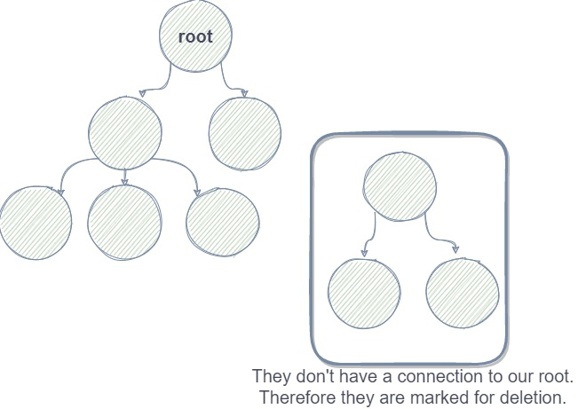
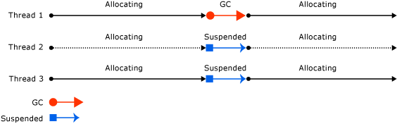
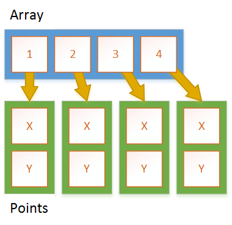
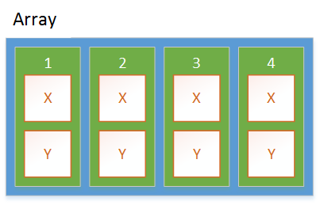

Let's have a deeper dive into the way the garbage collector (GC) works in .NET. We will see what different "Generation" means and how this all impact our application and its performance. Also if you use tools like BenchmarkDotNet, this will give you a better understanding of what some of the statistics mean.

## The Why

**Why do we have a garbage collector?** And the answer is very simple: Because we have a managed Heap. There are mainly two kinds of memory in .NET: the **stack** and the **heap**. I talked about this in detail [here](https://steven-giesel.com/blogPost/9a40d278-9a9f-49fe-bbfd-2d813a58e73e). To sum it up: The **stack** is used for static memory and the **heap** is used for dynamic memory. If we enter a new function a new **stack frame** is created, which then automatically gets deleted once we exit our function. That is a very convenient way of modeling a life-cycle. Now the **heap** does not get automatically cleaned up. And there are two ways now to handle that:

1. The C/C++ way: The developer is solely responsible for cleaning up memory.
2. We introduce a watchdog which runs through our objects and checks whether or not they can be deleted

As I earlier stated .NET is using the managed heap, which points to the second answer. And that is very very good. In C/C++ we had a lot of ["use after free"](https://encyclopedia.kaspersky.com/glossary/use-after-free/) errors or people forgot to cleanup resources which will lead to memory leaks. Not ideal!

That is why we have a garbage collector. Its whole job is to clean up after us.

## The How

There are mainly two phases that are important: A **marking** phase, which detects all live objects. After that comes the **sweep** phase which then clears the memory.

### **Marking** Phase

The sole purpose of that phase is to **mark** objects, that are not reachable anymore and therefore can be deleted. Simplified the GC has an internal representation of all your objects. Basically, all your objects have some kind of header which represent some meta information about them. So if you create a new class that only consists of one integer, you will address not only the 4 bytes of the integer and 4 or 8 bytes for the "pointer" (depending if 32-bit or 64-bit process) but also a small amount for the meta information but it is not anything to worry about.

How can the GC find "dead" objects? That is quite simple, it knows all objects and all objects are more or less related to one another. So if we create a dependency graph we can see which objects are "dead". Let's see this in the graph below. We have nodes which are basically references on the heap. Each reference can point to another one. Also, we have a "root". So every time something is not connected anymore to our root object, we can mark it.



### **Sweep** phase

As the name suggests the GC sweeps the memory and tells the OS: "Hey you that memory is free again and can be used.". But that is not really all. Imagine an object "survives" this process because it can't be reclaimed as it is currently still in use. Then the GC "promotes" those objects. This promotion is called "Generation".

## Generations

Microsoft sums it up pretty pretty well:

> Garbage collection primarily occurs with the reclamation of short-lived objects. To optimize the performance of the garbage collector, the managed heap is divided into three generations, 0, 1, and 2, so it can handle long-lived and short-lived objects separately. The garbage collector stores new objects in generation 0. Objects created early in the application's lifetime that survive collections are promoted and stored in generations 1 and 2. Because it's faster to compact a portion of the managed heap than the entire heap, this scheme allows the garbage collector to release the memory in a specific generation rather than release the memory for the entire managed heap each time it performs a collection.

<sup>[Source](https://docs.microsoft.com/en-us/dotnet/standard/garbage-collection/fundamentals#generations)</sup>

And there is a priority here: The GC tries to reclaim Generation 0 as fast as possible, then Generation 1 and then Generation 2. If you dig deeper you can also find Generation 3 and 4, which are very specialized things I will not talk about now simplifying them to Generation 2 now.

### Generation 0

Very short-lived objects like temporary variables.

```csharp
public void MyFunc()
{
    var tmp = new MyClass();
    tmp.Do();
}
```

After we leave `MyFunc` `tmp` is basically "dead" and can be removed. If your application is out of space and needs more memory Generation 0 is the first address where the GC looks to free up memory.

### Generation 1

This is a buffer between Generation 0 and 2. Here are all objects which survived Generation 0 and are still alive.

### Generation 2

There are basically two sets of references living here. First we have survivors of Generation 1. That can be for example static data which has the same lifecycle as your application. But also there is the [**L**arge **O**bject **H**eap short **LOH**](https://docs.microsoft.com/en-us/dotnet/standard/garbage-collection/large-object-heap). Every object which is bigger than 85000 bytes will **always** land in **Generation 2** no matter what. Examples of that would be very big arrays. The reason is simple: Claiming that space takes longer than Generation 0 or 1, which should be the last resort to gain some free space.

### The problem with the GC

Now why is this relevant in the first place? The answer is super simple:



When a GC run is triggered (also explicitly via `GC.Collect`) **all** threads of your application are suspended until the GC is done. That is why you have to take care of high GC pressure.

## Performance implications

We can see how all of this directly relates to performance. The more objects we have, the more the GC has to take care of it. If the GC has to run and claim some memory, **all** of our threads will be paused until the GC is done cleaning.

A few weeks ago I wrote an article about [how to create a low allocation StringBuilder.](https://steven-giesel.com/blogPost/4cada9a7-c462-4133-ad7f-e8b671987896) The idea here is exactly to minimize heap allocations and therefore stuff the GC has to take care of. There are certain scenarios where a stack allocation makes more sense than a heap allocation.

A very good example of that is an array of class vs an array of structs.

## Array of class vs array of struct

We can see the effects of the GC directly when using arrays of classes vs arrays of structures.

```csharp
[MemoryDiagnoser]
public class ArrayClassVsArrayStruct
{
    [Params(10, 1_000)]
    public int ObjectsToCreate { get; set; }

    [Benchmark(Baseline = true)]
    public void SlimClass()
    {
        var array = new SlimClass[ObjectsToCreate];
        for (var i = 0; i < ObjectsToCreate; i++)
            array[i] = new SlimClass();
    }

    [Benchmark]
    public void SlimStruct()
    {
        var array = new SlimStruct[ObjectsToCreate];
        for (var i = 0; i < ObjectsToCreate; i++)
            array[i] = new SlimStruct();
    }

    [Benchmark]
    public void SlimStructOnStack()
    {
        Span<SlimStruct> array = stackalloc SlimStruct[ObjectsToCreate];
        for (var i = 0; i < ObjectsToCreate; i++)
            array[i] = new SlimStruct();
    }
}

public class SlimClass { public int X; }
public struct SlimStruct { public int X; }
```

Results:

```csharp
|            Method | ObjectsToCreate |         Mean |       Error |      StdDev | Ratio | RatioSD |  Gen 0 | Allocated | Alloc Ratio |
|------------------ |---------------- |-------------:|------------:|------------:|------:|--------:|-------:|----------:|------------:|
|         SlimClass |              10 |    66.092 ns |   1.3584 ns |   3.6724 ns |  1.00 |    0.00 | 0.0823 |     344 B |        1.00 |
|        SlimStruct |              10 |    11.379 ns |   0.2654 ns |   0.7354 ns |  0.17 |    0.02 | 0.0153 |      64 B |        0.19 |
| SlimStructOnStack |              10 |     7.004 ns |   0.1775 ns |   0.2546 ns |  0.11 |    0.01 |      - |         - |        0.00 |
|                   |                 |              |             |             |       |         |        |           |             |
|         SlimClass |            1000 | 5,731.658 ns | 113.4555 ns | 298.8872 ns |  1.00 |    0.00 | 7.6599 |   32024 B |        1.00 |
|        SlimStruct |            1000 |   701.938 ns |  13.9287 ns |  28.4527 ns |  0.12 |    0.01 | 0.9613 |    4024 B |        0.13 |
| SlimStructOnStack |            1000 |   631.493 ns |  12.2856 ns |  14.6252 ns |  0.11 |    0.00 |      - |         - |        0.00 |

```

The reason for the difference in performance can be explained with this. When accessing an arrays of reference types we have to dereference the addresses (so one indirection more):



We also need more allocations. For the array itself plus every element inside the array. This is different for structs / value types. With a struct, it is super easy. We have **1** allocation. That is the array itself. Everything is "inline" or inside the array.



The `stackalloc` of course brings it to the extreme point where we have **no** allocations because everything is on the **stack** and nothing on the **heap**. This is perfect for high throughput scenarios or critical hot-paths.

## Conclusion

I hope I could give you a good introduction to the GC and how it works and why it is crucial to understand him. In normal daily life you will not interfere with the GC a lot.
