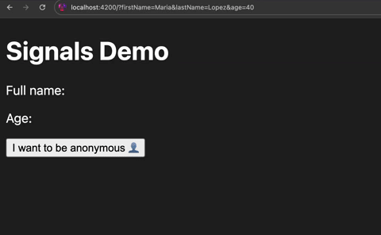
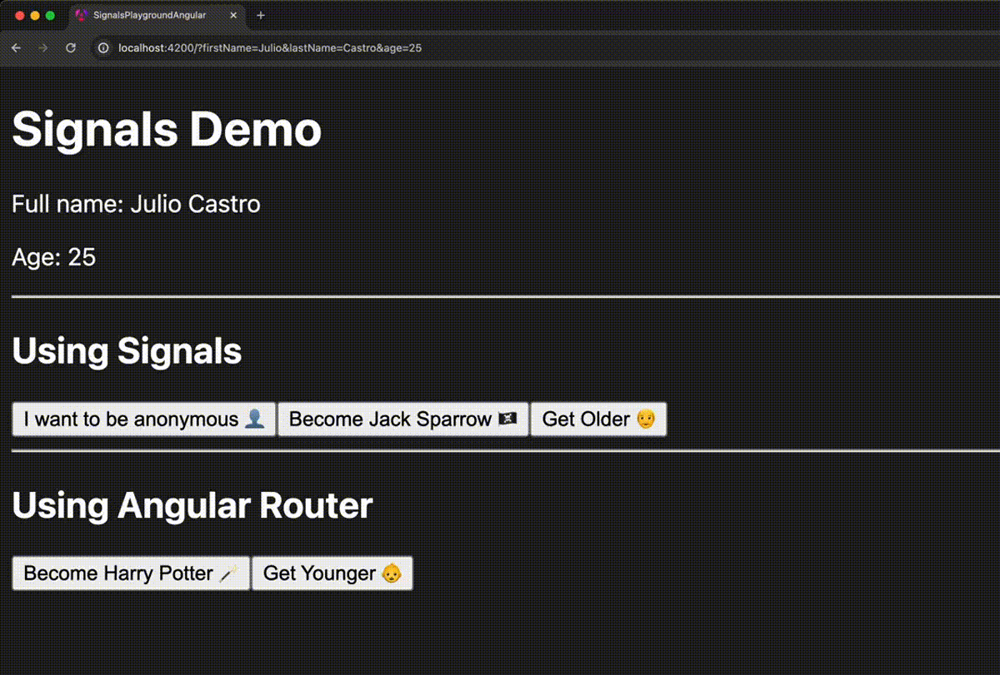

Signals are the hot topic of today. Pretty much every major framework (except React...) is introducing them in one way or another. Surprisingly, this is also the case for Angular, which is making huge efforts to improve a lot of the pain points we've been experiencing for too many years. A few examples of this include standalone components, a new build system leveraging esbuild and our protagonist of today: signals.

If you want to learn more about what signals are and a few interesting historical details about them, reach out to our amazing previous article [Signals, Signals everywhere][signalsEverywhereArticle] by [Lucas Schnüriger][lucasProfile].

The whole concept of signals is a pretty new topic in the Angular community. In fact, just a few weeks ago, [Angular 17.2][angular17.2] was released, introducing the possibility of using two-way binding along with signals. And not long before, [Angular 17.1][angular17.1] released a new API to receive `@Input()` values as signals.

Wait a minute, really? Weren't those important APIs already available when the Angular team released the first stable version of signals? Isn't two-way binding or, even more, parent-to-child communication basic features of the framework? Yes, we could claim that, but the Angular team is gradually introducing all these new concepts into the framework. And that's probably a good thing, since they are learning and listening to the community during the process. You can also influence it and give your opinion in the [open discussions][angularDiscussions].

In today's article, we'll experiment and push the limits of the current state of signals in the Angular framework. For that, we will implement an exciting two-way binding mechanism to connect signals with Angular's router state and the browser URL. Are you ready?

## The Challenge

Let's start with a simple application, which you can generate with the CLI and then remove the boilerplate code.

Once we have it, we are going to consume query params in the traditional way, using RxJS:

```ts
@Component({
  selector: "app-root",
  standalone: true,
  imports: [AsyncPipe],
  template: `
    <h1>Signals Demo</h1>
    <p>Your first name is: {{ firstName$ | async }}</p>
  `,
})
export class AppComponent {
  private activatedRoute = inject(ActivatedRoute);

  firstName$ = this.activatedRoute.queryParams.pipe(
    map((allQueryParams) => allQueryParams["firstName"])
  );
}
```


Great! This works and it's not necessarily inconvenient since Angular is handling the tedious task of managing subscriptions when we use the `async` pipe. Now let's see how this would look like with signals.

At the time of writing this article, Angular's router doesn't provide signals in its API. They will most likely get introduced in future releases, but for now we have to do a workaround. We can pick the current responses from Angular's router, which are based on RxJS's observables, and convert them to signals by using the `toSignal` utility function:

```ts
@Component({
  selector: "app-root",
  standalone: true,
  template: `
    <h1>Signals Demo</h1>
    <p>Your first name is: {{ firstName() }}</p>
  `,
})
export class AppComponent {
  private activatedRoute = inject(ActivatedRoute);

  firstName = toSignal(
    this.activatedRoute.queryParams.pipe(
      map((allQueryParams) => allQueryParams["firstName"])
    )
  );
}
```

This code will produce the exact same result as the RxJS-only approach. But now, notice that we don't need the `async` pipe anymore, or even to worry about managing subscriptions. The `firstName` signal will be connected to the `firstName` query param, and will be updated whenever there's a change on it. We can consume its value by just evaluating the signal and now we can use all the other interesting features like `computed`, `effect`, etc.

Let's make the example a bit more interesting by adding a few more query params and extracting the logic of creating the signal to a private method:

```ts
@Component({
  selector: "app-root",
  standalone: true,
  template: `
    <h1>Signals Demo</h1>
    <p>Full name: {{ fullName() }}</p>
    <p>Age: {{ age() }}</p>
  `,
})
export class AppComponent {
  private activatedRoute = inject(ActivatedRoute);

  firstName = this.getQueryParam("firstName");
  lastName = this.getQueryParam("lastName");
  age = this.getQueryParam("age");

  fullName = computed(() => `${this.firstName() ?? ""} ${this.lastName() ?? ""}`);

  private getQueryParam(name: string) {
    const value$ = this.activatedRoute.queryParams.pipe(
      map((allQueryParams) => allQueryParams[name])
    );

    return toSignal(value$);
  }
}
```


This is already pretty cool! We have a handy utility function to consume query params. Notice how easily we combined the `firstName` and `lastName` signals to compute the `fullName`, this would have been much more verbose and complicated using RxJS.

Let's add more features. Let's say we want a button to anonymise the user, meaning removing the values of `firstName` and `lastName`:

```ts
@Component({
  selector: "app-root",
  standalone: true,
  template: `
    <h1>Signals Demo</h1>
    <p>Full name: {{ fullName() }}</p>
    <p>Age: {{ age() }}</p>

    <button (click)="anonymise()">I want to be anonymous 👤</button>
  `,
})
export class AppComponent {
  private activatedRoute = inject(ActivatedRoute);
  private router = inject(Router);

  // ...

  anonymise() {
    const queryParams = { firstName: undefined, lastName: undefined };
    this.router.navigate([], { queryParams, queryParamsHandling: "merge" });
  }

  // ...
}
```


That's amazing! everything is working as expected, our signals are correctly getting the new `undefined` values and Angular is updating the UI accordingly.

Let's take a closer look at this `anonymise` method:

```ts
const queryParams = { firstName: undefined, lastName: undefined };
this.router.navigate([], { queryParams, queryParamsHandling: "merge" });
```

We want to modify the value of a certain query param through Angular's router API. This may surprise you but the easiest way is by triggering an "empty navigation" (notice the `[]`) and specifying the new query params in the configuration object.

Finally, the UI gets updated successfully because, once the router finishes the navigation, a new value will be emitted in the `activatedRoute.queryParams` observable, which we map and convert to the signals that we have in our component. So every time it emits a new value, our signals will be in sync.

This is very cool but we can do better:

```ts
anonymise() {
  // It's not very nice that we have to specify the query params again here ⬇️
  const queryParams = { firstName: undefined, lastName: undefined };
  this.router.navigate([], { queryParams, queryParamsHandling: "merge" });
}
```

Notice that we already have the `firstName` and `lastName` signals in our component. Wouldn't it be nicer if we could just **set** the new values of the query params on the signals directly? Something like this:

```ts
anonymise() {
  this.firstName.set(undefined)
  this.lastName.set(undefined)
}
```

That would be amazing, but unfortunately this doesn't work since the `toSignal` utility returns a read-only signal.

That doesn't mean we cannot do it ourselves though. Let's build it!

## Implementing Two-way binding between Signals and Query Params

First let's create a `QueryParamsService` so we separate the query param handling logic from our component:

```ts
@Injectable({ providedIn: "root" })
export class QueryParamService {
  private activatedRoute = inject(ActivatedRoute);

  get(queryParamName: string) {
    const value$ = this.activatedRoute.queryParams.pipe(
      map((allQueryParams) => allQueryParams[queryParamName])
    );

    return toSignal(value$);
  }
}
```

```ts
@Component({
  selector: "app-root",
  standalone: true,
  template: `
    <h1>Signals Demo</h1>
    <p>Full name: {{ fullName() }}</p>
    <p>Age: {{ age() }}</p>

    <button (click)="anonymise()">I want to be anonymous 👤</button>
  `,
})
export class AppComponent {
  private queryParamService = inject(QueryParamService);

  firstName = this.queryParamService.get("firstName");
  lastName = this.queryParamService.get("lastName");
  age = this.queryParamService.get("age");

  fullName = computed(() => `${this.firstName() ?? ""} ${this.lastName() ?? ""}`);

  anonymise() {
    // TODO: in a minute :)
  }
}
```

This small refactor will produce the same behavior as before, except for the anonymising feature which we will implement more adequately as soon as we make our `get` method from `QueryParamService` return a writable signal.

This is a very interesting challenge. So let's start simple:

```ts
@Injectable({ providedIn: "root" })
export class QueryParamService {
  private activatedRoute = inject(ActivatedRoute);

  get(queryParamName: string) {
    const queryParamValue = signal("");

    // TODO: connect signal with actual query param value.

    return queryParamValue;
  }
}
```

We need to return a writable signal, let's call it `queryParamValue`. Right now it is completely disconnected from the corresponding query param. That's the problem we want to solve.

More specifically, we need to connect it to the `activatedRoute.queryParams` observable, but manually creating and maintaining a subscription in our service doesn't sound like a signal-friendly idea:

```ts
@Injectable({ providedIn: "root" })
export class QueryParamService {
  private activatedRoute = inject(ActivatedRoute);

  get(queryParamName: string) {
    const queryParamValue = signal("");

    // This will "work" but we don't want to explicitly subscribe here ❌
    this.activatedRoute.queryParams.subscribe((allQueryParams) =>
      queryParamValue.set(allQueryParams[queryParamName])
    );

    return queryParamValue;
  }
}
```

A signal-friendly idea could be to convert the `activatedRoute.queryParams` observable to a signal itself and then somehow synchronize it with `queryParamValue`. We can achieve that with an effect:

```ts
@Injectable({ providedIn: "root" })
export class QueryParamService {
  private activatedRoute = inject(ActivatedRoute);
  private allQueryParams = toSignal(this.activatedRoute.queryParams);

  get(queryParamName: string) {
    const queryParamValue = signal("");

    effect(
      () => {
        const newQueryParamValue = this.allQueryParams()?.[queryParamName];
        queryParamValue.set(newQueryParamValue);
      },
      { allowSignalWrites: true }
    );

    return queryParamValue;
  }
}
```

Since we are accessing the value of the `allQueryParams` signal in the effect, it will run every time this signal gets updated, which happens every time Angular emits a new value in the `activatedRoute.queryParams` observable.

Inside the effect, we are just updating the value of our `queryParamValue` signal. For that, notice that we need to pass the `allowSignalWrites: true` option. This is necessary because updating signals in effects could lead to infinite loops and unexpected and intricate situations in general. That's why Angular disables this possibility by default.

However, in this scenario there's no danger to it: The effect is only triggered when `allQueryParams` is updated, that refreshes our `queryParamValue` signal and it finishes there. No danger of triggering an infinite loop or unexpected situations.


With the current solution we achieve the same behavior as before. However, we are not yet able to implement the anonymise feature in the nicer way. Yes, now we are returning a writable signal but, if we set or update its value there's going to be no effect in Angular's router state or in the browser URL. We'll achieve that in a minute but first let's improve a bit the current solution.

Notice that the effect will run every time the `allQueryParams` signal gets updated but that's too much. Remember that we are passing a `queryParamName` to our `get` method, meaning we are only interested in a specific query param in that context. For example, if we call the method with `age`, creating a signal linked to the `age` query param, then it doesn't make sense that its effect gets executed whenever the `firstName` or `lastName` query params get updated. Let's fix that:

```ts
@Injectable({ providedIn: "root" })
export class QueryParamService {
  private activatedRoute = inject(ActivatedRoute);
  private allQueryParams = toSignal(this.activatedRoute.queryParams);

  get(queryParamName: string) {
    const activatedRouteValue = computed(() => this.allQueryParams()?.[queryParamName]);
    const queryParamValue = signal(activatedRouteValue());

    effect(() => queryParamValue.set(activatedRouteValue()), { allowSignalWrites: true });

    return queryParamValue;
  }
}
```

With this version, we are creating a computed signal, `activatedRouteValue`, which is still connected to the `activatedRoute.queryParams` observable but only tracks the corresponding query param value we are interested inside the `get` method. Now, we define our effect using this signal, and not `allQueryParams`, this way the effect will only get executed when there's actually a new value to refresh our `queryParamValue` signal.

This is just slightly more efficient since the `computed` expression will still be evaluated every time `allQueryParams` gets updated. But, at least we won't trigger the effect that often. Additionally, we get another interesting advantage with this approach: We can properly initialize our `queryParamValue` signal:

```ts
const queryParamValue = signal(activatedRouteValue());
```

Accessing `activatedRouteValue` is basically the same as accessing `activatedRoute.snapshot.queryParams[queryParamName]`. Actually, doing the following would be equivalent:

```ts
const queryParamValue = signal(activatedRoute.snapshot.queryParams[queryParamName]);
```

But using the `activatedRouteValue` signal directly is a bit more concise. Apart from that, it's of course more interesting to initialize `queryParamValue` with something connected to `activatedRoute` and not just an empty string. So this is definitely a better solution than before.

Coming back to our goal, the only missing part is connecting changes made to our writable `queryParamValue` signal to Angular's router state and the browser URL. This way we would achieve the desired two-way binding.

Let's implement the missing part with another effect:

```ts
@Injectable({ providedIn: "root" })
export class QueryParamService {
  private activatedRoute = inject(ActivatedRoute);
  private router = inject(Router);

  private allQueryParams = toSignal(this.activatedRoute.queryParams);

  get(queryParamName: string) {
    const activatedRouteValue = computed(() => this.allQueryParams()?.[queryParamName]);
    const queryParamValue = signal(activatedRouteValue());

    effect(() => queryParamValue.set(activatedRouteValue()), { allowSignalWrites: true });

    effect(() =>
      this.router.navigate([], {
        queryParams: { [queryParamName]: queryParamValue() },
        queryParamsHandling: "merge",
      })
    );

    return queryParamValue;
  }
}
```

In this second effect we are using the same idea of navigating with Angular's router to the same place (look at the empty array `[]`), and then we just update the query params. Notice how we access our `queryParamValue` signal in this second effect, so it will be executed every time the writable signal gets updated.

When we look at this setup with the two effects, it seems like is going to enter in an infinite loop: the first effect makes `activatedRouteValue` to update `queryParamValue`, this will trigger the second effect, where `queryParamValue` will update `activatedRouteValue`, which will trigger the first effect again, and so on and so forth.

This infinite loop would happen if the values that are being assigned are different every time. That's one of the reasons we have to be very careful when we use `allowSignalWrites: true`. However, in this case we are safe. To illustrate it, let's consider the following situation:

```typescript
const activatedRouteValue = signal("red");
const queryParamValue = signal("blue");

// Something triggers a change in one signal. For example:
activatedRouteValue.set("purple");

// activatedRouteValue has changed from "red" to "purple" then trigger first effect:

// (Inside activatedRouteValue->queryParamValue effect):
queryParamValue.set("purple");

// queryParamValue has changed from "blue" to "purple" then trigger second effect:

// (Inside queryParamValue->activatedRouteValue effect):
activatedRouteValue.set("purple");

// activatedRouteValue is already "purple". It hasn't changed its value. Therefore,
// there's no need to trigger first effect again. End of the chain.
```

So this should be it, right? Well, unfortunately this doesn't work yet:



Apparently we have an empty state. Not only that, query params disappear from the browser URL. What is going on?

Well, most of it is related to Angular's router startup logic. Initially, Angular only emits the actual or real values of the query params through the `activatedRoute.queryParams` observable **when the first navigation** is completed.

This sounds surprising at first, specially when we try to access a query param that is initially provided in the browser URL and, through Angular's router API, its starting value is `undefined`. Why doesn't Angular just pick whatever is initially in the browser URL?

If you think about it, this behavior makes sense, there could be logic configured that affects the initial and all navigations in general, `guards` could be a good example of that. This means, some query params could be added or removed during a navigation, not necessarily matching what was initially available in the browser URL. And because of this, Angular is only sure about the actual or correct values of the query params as soon as the current navigation finishes.

During startup, no navigation has been completed yet. The current query params object in the Angular router is empty `{}`. If we try to access any query param in this period of time, it will be `undefined`. This situation affects us in the initial value we provide to our `queryParamValue` signal. If we use the `get` method from the `QueryParamService` in components that are loaded during the initial navigation, then our `queryParamValue` signal will be initialized to `undefined`. This is technically not a big deal since it is connected to the `activatedRoute.queryParams` observable. So as soon as Angular emits the actual value of the query param, then the signal will be updated accordingly. But the problem would have already occurred by then.

The actual issue with the empty UI is related to another not so intuitive behavior of Angular's router: Cancelling concurrent navigations. Maybe this surprises you but when we do `router.navigate`, this is actually an asynchronous operation, it returns a `Promise`, which is resolved whenever the navigation is completed.

The problem occurs when we trigger a `router.navigate` while a navigation is still in progress. When Angular detects this, it will **cancel the current navigation** and execute the new one instead, completely ignoring the previous one. How is this related to the empty UI problem? Let's take a look:

```ts
get(queryParamName: string) {
  const activatedRouteValue = computed(() => this.allQueryParams()?.[queryParamName]);
  const queryParamValue = signal(activatedRouteValue());

  effect(() => queryParamValue.set(activatedRouteValue()), { allowSignalWrites: true });

  effect(() =>
    this.router.navigate([], {
      queryParams: { [queryParamName]: queryParamValue() },
      queryParamsHandling: "merge",
    })
  );

  return queryParamValue;
}
```

The problem is in the second effect. Specifically during its first execution.

Effects are executed as soon as they are defined, this is necessary so they can keep track of the signals that are used inside of them.

When the second effect is initially executed, a navigation will be triggered, but a navigation that has no data. Remember that, during the startup period of time, the `queryParamValue` signal is initialized to `undefined`. So this "empty" navigation will be triggered, cancelling Angular's startup navigation and taking over. This loses the actual values of the query params because the startup navigation is the one that contains all the data provided in the browser URL when we load the application for the first time.

This sounds like a very tricky problem to solve. It would be convenient if Angular provided a way to synchronously navigate so we can forget about concurrent navigations cancelling each other. However, this is impossible in general. Remember that we could configure things like guards or resolvers that will force the navigation to be an asynchronous operation.

For this reason, we somehow need to **wait** for the current navigation to complete in order to execute the one that we have in the second effect. Fortunately, we can take advantage of `async/await` when dealing with signals, we just have to be careful so we don't get unexpected situations, pretty similar to what we discussed with `allowSignalWrites: true`.

This is the final version of the service, including logic to wait for the current navigation to complete:

```ts
@Injectable({ providedIn: "root" })
export class QueryParamService {
  private activatedRoute = inject(ActivatedRoute);
  private router = inject(Router);

  private allQueryParams = toSignal(this.activatedRoute.queryParams);

  get(queryParamName: string) {
    const activatedRouteValue = computed(() => this.allQueryParams()?.[queryParamName]);
    const queryParamValue = signal(activatedRouteValue());

    effect(() => queryParamValue.set(activatedRouteValue()), { allowSignalWrites: true });

    effect(async () => {
      const newValueToPushInRoute = queryParamValue();

      if (!this.router.navigated) return;
      while (this.isRouterNavigating()) await this.waitUntilRouterIsIdle();

      this.router.navigate([], {
        queryParams: { [queryParamName]: newValueToPushInRoute },
        queryParamsHandling: "merge",
      });
    });

    return queryParamValue;
  }

  private isRouterNavigating() {
    return this.router.getCurrentNavigation() !== null;
  }

  private waitUntilRouterIsIdle(): Promise<unknown> {
    return firstValueFrom(
      this.router.events.pipe(
        filter((e) => e instanceof NavigationEnd),
        timeout(1_000)
      )
    );
  }
}
```

It's interesting what we added to the second effect: First of all, we are using `async/await`. This is not a problem while we keep in mind that only the signals that we use before an `await` will be tracked. All the signals that we use after or, in general, in an asynchronous operation outside of the "regular" effect code, will not be considered. That's the reason we are accessing `queryParamValue` in the very top:

```ts
effect(async () => {
  // We access it here so the effect keeps track of it ✅
  const newValueToPushInRoute = queryParamValue();

  if (!this.router.navigated) return;
  while (this.isRouterNavigating()) await this.waitUntilRouterIsIdle();

  this.router.navigate([], {
    // If we would have accessed it here directly
    // the effect wouldn't consider it when we awaited ❌
    queryParams: { [queryParamName]: newValueToPushInRoute },
    queryParamsHandling: "merge",
  });
});
```

Then we have the conditions. The `if` protects us from the empty UI situation we saw before:

```ts
if (!this.router.navigated) return;
```

Basically `router.navigated` will be false while the initial navigation is still running. If that's the case, we are not interested in triggering a new `router.navigate`, because if we do so, we will remove all the query params, since during this period of time, our `queryParamValue` signal still has the startup value, meaning `undefined`.

Finally, the `while` loop prevents us from triggering a navigation while one is still on going:

```ts
while (this.isRouterNavigating()) await this.waitUntilRouterIsIdle();
```

This way, we don't have to worry that Angular may cancel navigations. We achieve this by using two handy private methods. One to check if there's a navigation happening, taking advantage of `router.getCurrentNavigation`. And, if so, waiting until it finishes.

The waiting logic is achieved by awaiting this `Promise`:

```ts
private waitUntilRouterIsIdle(): Promise<unknown> {
  return firstValueFrom(
    this.router.events.pipe(
      filter((e) => e instanceof NavigationEnd),
      timeout(1_000)
    )
  );
}
```

We simply use the `router.events` observable and filter until we find a `NavigationEnd` value. Then we just convert it to `Promise` using `firstValueFrom` so we can await it in the effect. Notice that there's also a `timeout` of 1s but we could think of a much more elaborated error handling in another iteration.

Once we have all the pieces ready, we made it! Now we have a nice utility that allow us to consume query params with signals. Not only that, those signals are writable and every time they are updated those values are propagated to Angular's router state and the browser URL.

Let's now see the nicer solution of the anonymise feature implemented with these signals. And perhaps a few more interesting use cases:

```ts
@Component({
  selector: 'app-root',
  standalone: true,
  template: `
    <h1>Signals Demo</h1>
    <p>Full name: {{ fullName() }}</p>
    <p>Age: {{ age() }}</p>

    <hr />

    <h2>Using Signals</h2>
    <button (click)="anonymise()">I want to be anonymous 👤</button>
    <button (click)="becomeJackSparrow()">Become Jack Sparrow 🏴‍☠️</button>
    <button (click)="getOlder()">Get Older 👴</button>

    <hr />

    <h2>Using Angular Router</h2>
    <button (click)="becomeHarryPotter()">Become Harry Potter 🪄</button>
    <button (click)="getYounger()">Get Younger 👶</button>
  `,
})
export class AppComponent {
  private queryParamService = inject(QueryParamService);
  private router = inject(Router);
  private activatedRoute = inject(ActivatedRoute);

  firstName = this.queryParamService.get('firstName');
  lastName = this.queryParamService.get('lastName');
  age = this.queryParamService.get('age');

  fullName = computed(
    () => `${this.firstName() ?? ''} ${this.lastName() ?? ''}`
  );

  // ---- using signals
  anonymise() {
    this.firstName.set(undefined);
    this.lastName.set(undefined);
  }

  becomeJackSparrow() {
    this.firstName.set('Jack');
    this.lastName.set('Sparrow');
  }

  getOlder() {
    this.age.set(+this.age() + 5);
  }

  // ---- using Angular router
  becomeHarryPotter() {
    const queryParams = { firstName: 'Harry', lastName: 'Potter' };
    this.router.navigate([], { queryParams, queryParamsHandling: 'merge' });
  }

  getYounger() {
    const queryParams = {
      age: +this.activatedRoute.snapshot.queryParams['age'] - 5,
    };
    this.router.navigate([], { queryParams, queryParamsHandling: 'merge' });
  }
}
```



Amazing! We can see that it works in both directions, whether we interact with our signals or if we use Angular's router API. In all scenarios everything gets updated accordingly.

This was a fun exercise to experiment with signals and the interoperability with current Angular APIs. Probably in the future there will be a native way to achieve the same result or at least support to implement it ourselves in an easier way.

Of course we can keep iterating our solution and perhaps adding support for batch updates of the query params, maybe making some extra checks in the effects so they run less frequently, etc. If you have any ideas about it or would like to discuss about all the new possibilities that signals bring to the frontend world I'd be more than happy to hear about it.

That's all for today but remember to stay tuned for more exciting articles about signals and much more in the Software Engineering Corner.

<!-- Links -->

[angular17.2]: https://github.com/angular/angular/releases/tag/17.2.0

[angular17.1]: https://github.com/angular/angular/releases/tag/17.1.0

[signalsEverywhereArticle]: https://software-engineering-corner.zuehlke.com/signals-signals-everywhere

[angularDiscussions]: https://github.com/angular/angular/discussions

[lucasProfile]: https://hashnode.com/@culas
